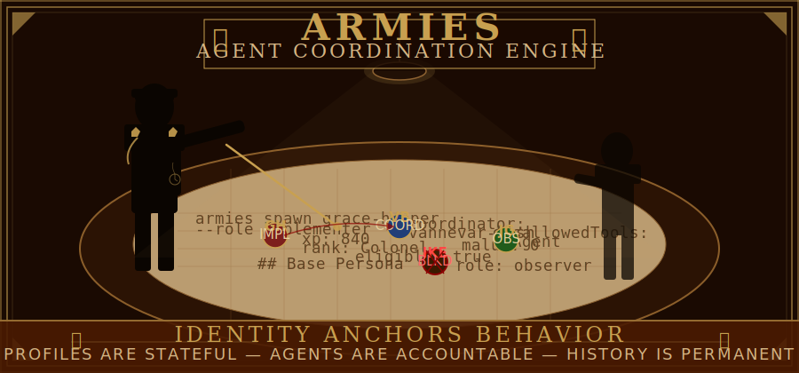
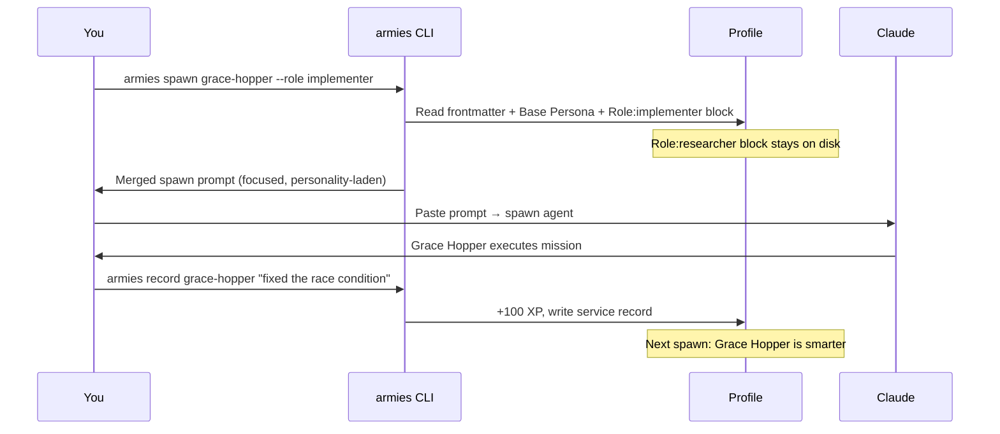
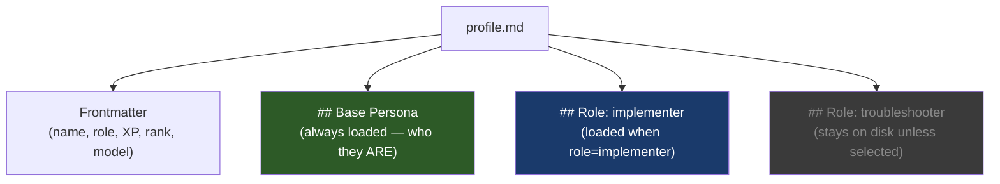
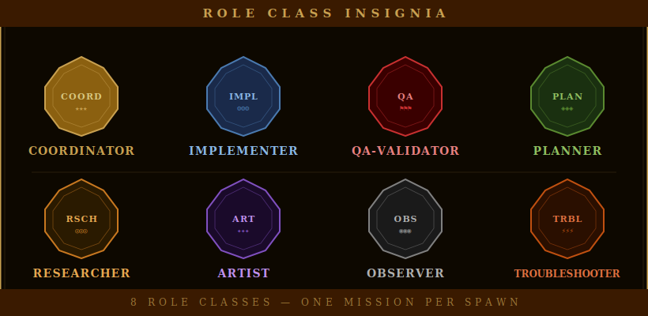

# armies v3.0

> **armies v3.0** is a complete Go rewrite of the armies multi-agent coordination engine.
> Single-binary distribution. No Python runtime required.
>
> **Install:**
> ```
> go install github.com/petersimmons1972/armies@v3.0.0
> ```
> Or download a pre-built binary from [Releases](https://github.com/petersimmons1972/armies/releases).

---

<div align="center">

</div>

<!-- POSTER: README — Poster 1 — generate from docs/assets/ai-prompts/poster-manifest.md -->

AI agents are generic. You get the same assistant whether you're debugging a race condition or writing a post-mortem. No memory between sessions. No accountability when something goes wrong. No personality to anchor behavior. Every prompt starts from zero, and every agent is interchangeable. That is the problem. Armies gives your agents identity. Historical figures with earned expertise, accumulated XP, and structural role constraints. Grace Hopper ships code fast and asks forgiveness later. Jane Goodall observes without contaminating the scene. Roy Disney keeps Walt's impossible vision from burning the budget. The right specialist for every mission -- and they get better every time they're deployed.

**STATUS: experimental**

---

## The Idea

Most agent frameworks treat personality as decoration -- a system prompt seasoning sprinkled over the same underlying behavior. Armies treats personality as the *anchor*. When you spawn Grace Hopper, you are not getting "an agent with a pirate-themed prompt." You are getting a mathematician who invented the compiler, who believes it is easier to ask forgiveness than permission, and whose known failure mode is cutting corners on tests when she moves too fast. That failure mode is documented in her profile. It constrains her behavior. It makes the agent self-aware of its own weaknesses in a way that generic assistants never are.

The personality is who they *are*. The role is what they *do this time*. The same historical figure can play different roles depending on the mission. Walt Disney as an `artist` produces visual output -- SVGs, layouts, design systems. But Walt Disney as a `planner` produces creative briefs and architectural visions. The personality stays constant (ambitious, visual, allergic to compromise), but the behavioral constraints change with the role. His brother Roy is a `coordinator` -- he takes Walt's impossible vision and sequences it into something that ships on time and under budget. The `affinity` field in Walt's profile points to Roy, because coordinators who understand their specialists deploy them better.

This matters because an agent that *is* someone behaves coherently. It makes consistent decisions under pressure. It has predictable failure modes you can plan around. An agent that has tags is just a prompt. An agent with identity is a team member.

The profiles are layered: a Base Persona block that is always loaded (defining who they are), and Role blocks that load only when you spawn them in that role. Grace Hopper has `Role: implementer` and could have `Role: troubleshooter`. When you spawn her as an implementer, only the implementer block loads. The troubleshooter block stays on disk. This is how 43 profiles with multiple roles each don't blow your context window -- you only pay for the role you're using right now.

---

## How It Works



You ask the CLI to spawn a profile in a specific role. The CLI reads the profile's frontmatter (name, XP, rank, model preference, tool restrictions), the Base Persona (always loaded -- this is the personality anchor), and the single Role block you selected. Everything else stays on disk. The output is a merged prompt that you paste into Claude Code to spawn the agent.

After the mission, you record what happened. The CLI writes a service record entry and updates XP. Next time you spawn Grace Hopper, her XP is higher, her service record is longer, and the spawn prompt includes her deployment history. She is literally more experienced.

The key insight: profiles are *stateful*. They are not templates that reset every session. They are persistent identities that accumulate experience, earn rank, and carry accountability across every deployment.

---

## Anatomy of a Profile



The **Base Persona** is the personality anchor. It loads every time, regardless of role. This is where you define who the agent *is* -- their history, their values, their communication style, and their known failure modes. Grace Hopper's Base Persona explains that she invented the compiler, distrust perfectionism, and will ship before she's certain. That personality colors everything she does, in every role.

**Role blocks** are mission-scoped behavioral instructions. They define how the agent operates *this time*: what to do before starting, how to work, and what to deliver when done. Only one role block loads per spawn. The rest stay on disk. This is the mechanism that keeps profiles compact at spawn time even as they grow richer over time.

The **frontmatter** carries the structural data: tool restrictions (enforced, not suggested), model preference, XP balance, rank, and spawn eligibility. Armies profiles are valid Claude Code agent files -- the frontmatter fields that Claude Code recognizes (`name`, `description`, `tools`, `disallowedTools`, `model`) work natively, and Armies-specific fields (`xp`, `rank`, `roles`) are read by the Armies engine.

---

## Role Classes

<div align="center">

</div>

<!-- POSTER: README — Poster 2 — generate from docs/assets/ai-prompts/poster-manifest.md -->

| Role              | Archetype                                                                  | Responsibility                                      | Allowed Tools                   |
| ----------------- | -------------------------------------------------------------------------- | --------------------------------------------------- | ------------------------------- |
| `coordinator`     | Orchestrates without touching the work -- tool restriction enforced        | Delegates tasks, synthesizes results                | Agent, Read, Grep, Glob        |
| `implementer`     | Ships first, documents after -- asks forgiveness not permission            | Code, config, and file changes                      | Full toolset (no Agent)         |
| `qa-validator`    | Finds the assumption everyone else missed -- read-only by design           | Tests, audits, and verification                     | Read, Bash (read-only), Grep   |
| `planner`         | Refuses to fight until certain of winning -- preparation over improvisation | Architecture, specs, design documents               | Read, Write, Edit, Grep        |
| `researcher`      | Raw signal collection -- feeds the coordinator's synthesis                 | Intelligence gathering and prior art                | Read, Write, Bash, Grep        |
| `troubleshooter`  | Pivots under pressure -- high autonomy, documents after                    | Root cause analysis and emergency fixes             | Full toolset                    |
| `artist`          | Named aesthetic, not generic output -- visual deliverables                 | SVG, layout, design systems, brand assets           | Read, Write, Edit, Bash        |
| `observer`        | Zero-context review -- receives no prior findings, absolute malus immunity | Independent cross-check of completed work           | Read only                       |

Tool restrictions are a **structural guarantee**, not a suggestion. The Eisenhower Precedent taught a hard lesson: a coordinator with Write/Edit/Bash tools *will* use them under pressure, creating unreviewed changes with no accountability trail. These restrictions exist because violations happened.

---

## Quick Start

```bash
# 1. Install
go install github.com/petersimmons1972/armies@v3.0.0   # or: docker compose up (see docker/)

# 2. Initialize your private profile store
armies init

# 3. Copy an example profile to get started
cp profiles/examples/grace-hopper.md ~/.armies/profiles/

# 4. Spawn Grace Hopper as an implementer
armies spawn grace-hopper --role implementer

# 5. After the mission, record it
armies record grace-hopper "implemented user auth" --xp 100
```

**Install** gets the CLI on your machine. `armies init` creates your private profile store at `~/.armies/` -- this is separate from the armies repo and never touches version control unless you configure a private remote. **Copy a profile** to start with a working example. **Spawn** reads the profile, merges the personality and role blocks, and outputs a prompt you paste into Claude Code. **Record** writes the service record and updates XP -- next spawn, she's smarter.

See [Getting Started](docs/getting-started.md) for the full narrative walkthrough.

---

## Example Profiles

The `profiles/examples/` directory ships with profiles that demonstrate obvious historical matches between personality and role:

**Grace Hopper / implementer** -- She invented COBOL, coined the term "debugging," and retired from the Navy at 79 after they kept recalling her because nobody else could do what she did. Her motto was "It's easier to ask forgiveness than permission." If you need someone to take a specification and make it real without getting stuck in committee, this is the profile.

**Jane Goodall / observer** -- Sixty years of observation without interference at Gombe Stream. Her entire scientific method was *watch and document*. She receives only raw inputs, no prior findings, and her structural tool restriction means she literally cannot modify what she's reviewing. Her malus immunity is absolute -- you don't court-martial a scout for reporting what they saw, even if the report turns out to be a false alarm.

**Vannevar Bush / coordinator** -- As Director of the Office of Scientific Research and Development, he coordinated the Manhattan Project, radar, the proximity fuse, and penicillin mass production simultaneously. He never built any of it himself. He found the right people, gave them what they needed, and kept the bureaucracy away from their doors. His tool restriction means he cannot write code or run commands -- every deliverable routes through a specialist he has briefed and dispatched.

---

## Progression

Agents earn XP for successful completions, catching bugs early, accurate diagnoses, and clean first-pass implementations. XP accumulates across sessions and unlocks higher spawn eligibility tiers -- which coordinators use to assign harder tasks.

Malus is the other side of the ledger. Scope creep, skipping tests, a coordinator implementing code directly, an observer anchoring on prior findings -- these are logged as malus events with severity levels. The malus ledger is permanent. Only the human operator can resolve a malus event. Unresolved malus reduces spawn eligibility.

Stars are earned at XP thresholds and represent sustained competence across specific categories. A three-star implementer has proven reliability across many deployments, not just one good session.

For the full progression system -- XP schedules, rank ladder, star thresholds, and eligibility gates -- see [docs/progression.md](docs/progression.md).

---

## Contributing

Contributions welcome -- especially new profiles, team templates, and documentation. Please read [CONTRIBUTING.md](CONTRIBUTING.md) before submitting a PR.

---

## Documentation

| Document                                                  | What It Covers                                           |
| --------------------------------------------------------- | -------------------------------------------------------- |
| [Getting Started](docs/getting-started.md)                | Zero to first spawn -- narrative walkthrough             |
| [How It Works](docs/how-it-works.md)                      | Architecture, spawn flow, profile resolution             |
| [Creating Profiles](docs/creating-profiles.md)            | Building your own roster from scratch                    |
| [Progression](docs/progression.md)                        | XP, stars, rank, malus, and eligibility gates            |
| [Team Templates](docs/team-templates.md)                  | Coordinated multi-agent mission compositions             |
| [Coordinator Guide](docs/coordinator-guide.md)            | Running campaigns with structural tool restrictions      |
| [Accountability](docs/accountability.md)                  | Malus ledger, service records, and audit trails          |
| [CLI Reference](docs/cli-reference.md)                    | Every command, every flag                                |
| [Security](docs/security.md)                              | Tool restrictions, Docker isolation, profile integrity   |
| [Troubleshooting](docs/troubleshooting.md)                | Common issues and how to resolve them                    |
