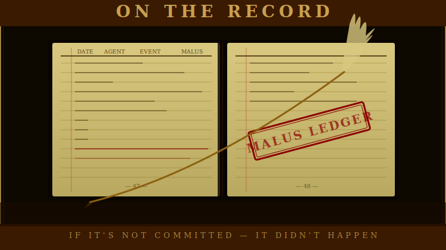

# The Accountability System

<div align="center">

</div>

<!-- POSTER: Accountability — Poster 1 — generate from docs/assets/ai-prompts/poster-manifest.md -->

## Why Malus Is Separate From XP

Most accountability systems work by subtraction. You earn points, you lose points, your score reflects the net. Simple to understand. Easy to implement. And deeply wrong in the way it conflates two distinct signals into noise.

In Armies, XP only goes up. A failed mission earns less XP than a successful one, but Grace Hopper's prior 600 XP is never at risk. An agent's XP reflects their total accumulated contribution — the complete history of work deployed, problems solved, campaigns completed. It is a measure of investment, not of current standing.

Malus operates on a completely separate ledger. It tracks accountability for defects and failures. It has its own scoring. It has its own consequences. It decays (or, for the most serious entries, doesn't). It governs spawn eligibility in ways that XP does not.

The separation exists because XP and malus answer different questions. XP answers: how much has this agent contributed over their career? Malus answers: what is this agent's current accountability standing? Mixing them would force a single number to answer both questions simultaneously — and a number that answers two questions at once is answering neither well.

Consider what mixing would produce: a highly experienced agent with one recent serious failure would lose years of accumulated expertise from a single bad deployment. That is not accountability. It is arbitrariness. A new agent with three small failures would look identical to a veteran with one large one, when their situations are completely different. The single-score model destroys the information you actually need to make good deployment decisions.

The separation means you can look at an agent's XP and know their genuine history. You can look at their malus and know their recent accountability standing. The two numbers mean different things. Use them that way.

---

## Filing a Malus Entry

A malus entry is the formal record of a defect or failure. It connects the incident to the agents responsible, assigns the points, and links to the GitHub issue where the context lives.

No malus entry is valid without a GitHub issue. This is not a formality. The issue is where the incident description, the discussion, and any remediation notes live. The malus entry is a structured pointer to that context — it is not the context itself. If an incident has no GitHub issue, it does not officially exist yet. File the issue first, then file the malus entry.

The format, with every field explained:

```yaml
- id: MAL-001
  date: "2026-03-22"
  incident: >
    Brief, factual description. One or two sentences. Describes what happened,
    not who is at fault — allocation handles attribution.
  severity: P0
  raw_malus: 100
  root_cause: operational_malpractice
  decays: false
  allocation:
    - general: Eisenhower
      role: coordinator
      share: 100
      rationale: "Refused to delegate; acted as sole implementer in violation of coordination mandate"
  related_issue: "https://github.com/org/repo/issues/1"
  operation: "Clearwatch 60-Report Sprint"
  fixed_by: "Founder"
  confirmed_by: "Founder"
  notes: >
    Optional additional context: founding precedents, dispute notes,
    relationship to other entries.
```

**`id`** — Sequential, permanent. Never reuse or delete an ID, even for entries that are disputed or reversed. If an entry is overturned, annotate the notes field — the ID stays.

**`date`** — The date the incident was identified, not necessarily when it was committed. This date anchors the decay calculation. It should reflect when accountability was established, not when the underlying error occurred.

**`incident`** — Factual description of what happened. Avoid blame language — the incident describes the event, the allocation describes responsibility. These are separate concerns and keeping them separate prevents the entry from reading as advocacy.

**`severity`** — P0, P1, P2, or P3. Determines the raw malus points. See the severity guide below.

**`raw_malus`** — Points before decay or allocation split. Must match the severity: P0=100, P1=60, P2=30, P3=10. This is the pool that gets split across agents via the allocation shares.

**`root_cause`** — The category of failure. Drives allocation defaults and, critically, determines whether the entry decays. The eight categories are covered in the decay section.

**`decays`** — The most important field in the entry. `true` means this is a normal defect that reduces in effective malus over time. `false` means this is a judgment failure that is a permanent career mark. The rule is exact: set `decays: false` if and only if `root_cause` is `operational_malpractice`, `strategic_malpractice`, or `insubordination`. Every other root cause decays.

**`allocation`** — The split across agents responsible. Shares must sum to 100%. Each entry in the array specifies the agent's name, their role in the failure (primary, secondary, tertiary, coordinator), their share of the raw malus pool, and a rationale when the allocation deviates from defaults.

**`related_issue`** — Full GitHub issue URL. Mandatory. File the issue first.

**`fixed_by`** — Who diagnosed and repaired the defect. Standard chain: fixer proposes allocation, coordinator confirms, founder arbitrates only if disputed.

**`confirmed_by`** — The coordinator or founder who reviewed and confirmed the allocation. No malus is recorded without at least fixer and coordinator agreement.

---

## Severity Guide With Examples

The severity level sets the raw malus points. Calibrating severity correctly is the most consequential decision in filing an entry — it determines both the immediate accountability burden and, for decaying entries, how long that burden persists.

| Severity | Points | Category | Concrete Examples |
|----------|--------|----------|--------------------|
| P0       | 100    | Strategic malpractice, production outage, data loss | Coordinator writes all reports instead of delegating, introducing 13 errors; Security credentials exposed in public commit; Database migration destroys production data; Report pipeline produces zero output for all 60 reports |
| P1       |  60    | Major feature broken, visible defect in output, insubordination | Chart overlaps in all rendered reports (broken layout); Authentication broken after refactor; Dispatching 8 agents simultaneously without context, blocking all downstream work; Violating direct founder instructions after explicit correction |
| P2       |  30    | Moderate defect, degraded functionality, rework required | Wrong approach that had to be completely redone; Report generation works but is 5x slower than spec; Missing chart enhancement that was specified in brief |
| P3       |  10    | Minor error, cosmetic, corrected within same session | Wrong assumption caught and corrected before delivery; Incomplete service record; Padding inconsistent with design system; Tooltip text has minor typo |

The P0/P1 line is drawn at "does this block or break something that is supposed to work." If the output is unusable or a system is down, P0. If the output is degraded, wrong, or a significant feature doesn't work, P1.

The P2/P3 line is drawn at "does this require rework or can it be corrected quickly." If the implementation has to be substantially redone — if the approach was wrong, not just the execution — P2. If it's a minor correction made within the same session without rework, P3.

For judgment failures (malpractice and insubordination), severity follows the impact of the failure, not just the category. The Eisenhower operational malpractice entry is P0 because writing 60 reports yourself instead of coordinating them is a foundational role violation with immediate systemic impact (13 errors, founder intervention required). An operational malpractice entry that caused minimal immediate harm might be P1. Use judgment.

---

## Allocation: Who Bears What

The allocation splits the raw malus pool across the agents who contributed to the failure. Shares must sum to 100%. A single agent can bear 100% when no other parties contributed.

The role field in each allocation entry indicates the nature of the contribution and suggests expected share ranges:

**Primary (50–60%)** — The agent whose action or inaction directly caused the defect. For implementation errors, this is the implementer. For design flaws, this is the designer. For operational malpractice, this is the agent who violated their mandate.

**Secondary (25–30%)** — The agent who should have caught the issue. For implementation errors, this is typically the coordinator or reviewer. Bad upstream data is not a complete defense for secondary parties — an agent who notices data quality issues and fails to flag them still bears secondary share.

**Tertiary (10–15%)** — A contributing party with more distal responsibility. An upstream team whose data quality affected the outcome. A designer whose spec created the conditions for an error.

**Coordinator (variable)** — The coordinator who oversaw the operation. Coordinators bear responsibility for failures that resulted from unclear briefing, inadequate verification, or choosing the wrong specialist for a task.

These are guidelines, not hard limits. Root cause analysis may justify deviation, but when you deviate significantly, the rationale field is required.

### Observer Immunity

One rule has no exceptions: observers cannot be assigned malus, ever, for anything they were brought in to review.

The logic is structural. Observer immunity exists because without it, observers would have personal incentive to soften or miss findings. A reviewer who might share blame for defects they didn't catch has every cognitive incentive to not look too hard. Observer immunity eliminates that incentive completely. Observers can report exactly what they see, with full aggression, without any fear of shared accountability.

Observers earn flat XP for completing the review. When they catch defects before they ship, those catches are logged in the saves ledger — a separate positive accounting that rewards effective observation without the negative mechanics of malus exposure.

---

## The Decay Formula

For normal defects — anything with `decays: true` — effective malus decreases over time according to a 14-day half-life.

```
effective = raw_malus × (share / 100) × (0.5 ^ (days_since / 14))
```

Walk through a concrete example: a P0 entry filed today, 100% allocation to one agent.

| Day | Calculation | Effective Malus |
|-----|-------------|-----------------|
|   0 | 100 × 1.0 × 1.000 | 100.0 |
|   7 | 100 × 1.0 × 0.707 |  70.7 |
|  14 | 100 × 1.0 × 0.500 |  50.0 — first half-life |
|  28 | 100 × 1.0 × 0.250 |  25.0 — second half-life |
|  42 | 100 × 1.0 × 0.125 |  12.5 |
|  56 | 100 × 1.0 × 0.063 |   6.3 — effectively negligible |
|  84 | 100 × 1.0 × 0.016 |   1.6 |

The decay is exponential. A serious failure this week is a serious blocker this week — the full 100 points applies immediately. Six weeks later it is barely noise. Three months later it is functionally gone.

This calibration reflects a real principle: errors that have been corrected, that have not recurred, and that have accumulated time without new incidents, should not define an agent's current standing forever. Skills improve. Judgment can be re-demonstrated. The decay gives agents a path forward from normal mistakes.

Notice also that the decay formula rewards time without new incidents. If an agent files two P2 entries in the same week, they start at 60 effective points and both begin decaying. If they file a third P2 entry the following week, that third entry's decay starts from its own date — it does not reset the first two. The system tracks each entry independently and sums them fresh at check time.

Effective malus is never cached. Every spawn eligibility check recomputes from the ledger using the current date. An agent who was blocked on Monday because of a recent P0 may be eligible by Thursday as that P0 decays. There is no manual intervention required — the arithmetic handles it.

---

<!-- POSTER: Accountability — Poster 2 — generate from docs/assets/ai-prompts/poster-manifest.md -->

## What Never Decays

Three root cause categories set `decays: false`. These are permanent career marks, and the distinction from normal defects is intentional.

Skill gaps improve over time. An agent who makes an implementation error this week has demonstrated something about their current capability — something worth tracking — but the same error six months from now would be a different, independent piece of evidence. The decay model for normal defects reflects this: it gives weight to recency without making past errors permanent.

Judgment failures are different. They are not evidence of a skill gap. They are evidence of a character or mandate problem — a willingness to provide harmful counsel, a refusal to execute the assigned role, a choice to violate direct instructions. These are not problems that improve by waiting. An agent who was willing to recommend deferring foundational security controls in March is not, simply by virtue of time passing, less likely to recommend it again in September. The underlying judgment has not been demonstrated to have changed.

This is why the three malpractice categories carry no decay. They are permanent until the founder explicitly determines otherwise.

### Strategic Malpractice: The CISO Precedent

Strategic malpractice is counsel that would cause systemic, organization-level harm if followed.

The founding case: the CISO was retired from the active roster after recommending "accept risk" on network segmentation, RBAC, and supply chain controls. The CISO framed these as pragmatic deferral decisions — the kind of trade-offs organizations make when resources are constrained.

This mirrors the security posture that caused the Home Depot breach in 2014. Fifty-six million credit card numbers stolen. Flat networks. Excessive vendor access. Foundational controls deferred as structural debt. The CISO's individual patches were technically competent. The malpractice was strategic — lazy thinking about systemic risk dressed as pragmatism.

The rule established: recommending that foundational security controls — network segmentation, RBAC, supply chain verification — be deferred or accepted as structural debt is strategic malpractice, regardless of business justification offered. A general who advises this is not being pragmatic. They are being negligent.

Strategic malpractice is the more serious of the two malpractice categories because the harm is systemic. The wrong advice, if followed, would compound silently and catastrophically.

### Operational Malpractice: The Eisenhower Precedent

Operational malpractice is refusing to execute the role you were assigned.

The founding case: Eisenhower was assigned to coordinate 60+ Clearwatch reports. He wrote them all himself instead, bypassing delegation entirely. Thirteen errors before the founder caught it and corrected.

The coordinator role exists for reasons beyond individual capability. Coordination produces a different kind of quality than individual execution — parallel workstreams, independent validation, checks between specialists. When a coordinator implements instead of coordinating, they undermine the architecture that the coordinator role is designed to enforce. This is not an error. It is a mandate violation.

Note the precision of the category name: it is operational malpractice, not operational error. Error means you tried to do the right thing and got it wrong. Malpractice means you knew what you were supposed to do and refused to do it — or, more charitably, you convinced yourself that your way was better and acted unilaterally. Both produce the same result: a role violation that harms the mission.

Eisenhower had 550 XP at the time. High XP does not exempt a general from accountability. The purpose of XP is precisely to be unaffected by malus — it stands as a genuine record of contribution. But it carries no immunity.

### Insubordination

Insubordination is the violation of direct founder instructions after explicit correction.

The distinction from error is critical. Error is doing the wrong thing without realizing it. Insubordination is continuing to do the wrong thing after being told explicitly to stop. The explicit correction is the dividing line. An agent who makes a mistake and corrects when told has made an error. An agent who continues after correction has made a choice.

Insubordination is always a separate offense from the operational or strategic failure it accompanies. When Eisenhower committed operational malpractice and also violated specific founder instructions to coordinate rather than implement, both entries were filed. They do not merge. Insubordination compounds with other offenses — it does not subsume them or get absorbed into them.

The compounding is the point. An agent who makes a mistake and an agent who makes the same mistake and refuses to stop when told are not in the same situation. The refusal is independent evidence about judgment and mandate adherence. It deserves independent accounting.

---

## Checking Spawn Eligibility

Before any spawn, the coordinator checks eligibility:

```bash
armies eligible <agent-name>
```

Or directly:

```bash
python ~/projects/generals/bin/check-general-eligibility.py <name> <role>
```

The command computes effective malus fresh from the ledger using the current date, then looks up the result against the eligibility table.

Example output for Eisenhower as of the founding precedent entries:

```
Agent:           Eisenhower
Effective Malus: 160.0  (no decay — permanent entries MAL-001, MAL-002)
Tier:            Warning (100–199)

  coordinator:       BLOCKED
  emergency_reserve: FOUNDER APPROVAL REQUIRED
  specialist:        CLEAR
  validator:         CLEAR
```

What each tier means operationally — not just the label, but what it means for a coordinator deciding whether to spawn:

**Clean (0–99):** No restrictions. All roles available. Standard briefing and verification practices apply.

**Warning (100–199):** Coordinator role is blocked. This tier typically contains at least one non-decaying entry — a judgment failure that has not been remediated. The agent can still work as a specialist or validator without restrictions. Emergency reserve is possible but requires explicit founder approval before the spawn proceeds. The coordinator weighs the crisis severity against the malus standing; the founder makes the call.

**Probation (200–299):** Coordinator and emergency reserve are both blocked. Specialist work is permitted, but every output requires mandatory review before acceptance. The agent must deliver zero-defect on their next deployment to demonstrate the underlying issue has been corrected. Reduced autonomy — work under active coordinator supervision.

**Demotion risk (300–399):** Coordinator and emergency reserve remain blocked. Specialist work is technically permitted, but the coordinator must escalate to the founder before and during the deployment. Role downgrade — from specialist to observer-only, for example — is actively under consideration at this tier. Founder review is required before any spawn.

**Suspension (400+):** Complete block. No role is available. The agent is removed from the active roster pending founder review. No deployment proceeds until the founder explicitly issues written clearance — a GitHub issue or comment specifying which roles are restored and any conditions on the restoration. A founder authorization from a previous session does not carry over.

### A Note on the Blocking Logic

The eligibility tiers are calibrated to match the severity of the demonstrated failure to the risk of the role.

Coordinator is the first role to be blocked (at 100+ effective malus) because it is the role where compromised judgment has the most systemic effect. A coordinator with compromised judgment in orchestration doesn't just affect one workstream — they affect every workstream they touch. The block is proportionate to the leverage.

Validator is the last role to become unavailable (at 400+, when everything is blocked) because validators catch problems rather than cause them. A high-malus validator who is aggressive and thorough still provides net-positive value to the mission. Blocking validators early would reduce quality assurance capacity without a corresponding safety benefit. The calibration reflects that.

Observer is not a spawn role in the eligibility table at all. Any agent can be an observer regardless of malus level, because observers cannot earn malus in that role. Bringing in a high-malus agent as a zero-context reviewer does not create accountability risk — it creates review capacity. The observer's contamination immunity runs in both directions.

Spawning a blocked agent without founder approval is itself a coordination failure. The coordinator who bypasses the eligibility check does not get the benefit of the doubt — they have demonstrated the same kind of judgment that creates malus entries. Check eligibility. Every time.
