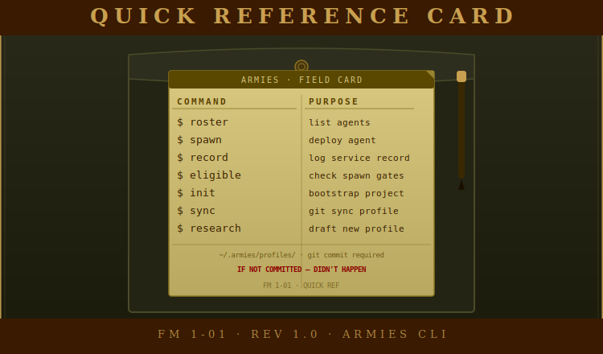

# CLI Reference

<div align="center">

</div>

<!-- POSTER: CLI Reference — Poster 1 — generate from docs/assets/ai-prompts/poster-manifest.md -->

Complete reference for every `armies` command. All commands write to stdout and exit non-zero on failure. The binary has no runtime dependencies -- no Python, no virtual environment, no Docker required.

---

## armies roster

Scans `~/.armies/profiles/` for `.md` files, reads their YAML frontmatter (not the full body -- progressive loading), and displays an ASCII table. If `~/.armies/accountability/malus-ledger.yaml` exists, live eligibility is computed from it. If the ledger is absent, all agents are shown as eligible.

### Syntax

```
armies roster
```

No flags. No arguments.

### What to expect

The table is rendered using go-pretty with ASCII borders -- pipe characters and plus signs, no Unicode box-drawing. The columns are:

- **name** -- the machine identifier (what you pass to `spawn`, `record`, `eligible`)
- **display_name** -- the human-readable name from the profile frontmatter
- **primary_role** -- the agent's primary role class
- **xp** -- total accumulated experience points
- **rank** -- current rank (Colonel by default for new profiles)
- **eligibility** -- current spawn eligibility status based on the malus ledger

### Example output

```
+-------------------+-----------------------------+---------------+------+-------------+---------------------+
| name              | display_name                | primary_role  | xp   | rank        | eligibility         |
+-------------------+-----------------------------+---------------+------+-------------+---------------------+
| grace-hopper      | Rear Admiral Grace Hopper   | implementer   | 840  | Colonel     | eligible            |
| eisenhower        | General Dwight D. Eisenhower| coordinator   | 1200 | Maj. General| BLOCKED             |
| spruance          | Admiral Raymond A. Spruance | validator     | 620  | Captain     | eligible            |
+-------------------+-----------------------------+---------------+------+-------------+---------------------+
```

The `eligibility` column shows one of:

- `eligible` -- all roles available
- `restricted` -- at least one role blocked but others clear
- `BLOCKED` -- suspended, no roles available

### Error cases

| Symptom                                           | Cause                                   | Fix                                                        |
| ------------------------------------------------- | --------------------------------------- | ---------------------------------------------------------- |
| `No profiles found in /home/user/.armies/profiles` | Profiles directory is empty            | Run `armies init`, then run `armies seed` or copy a profile |
| Nothing printed, exit 0                           | YAML parse error in one or more profiles | Check frontmatter syntax -- see Troubleshooting             |

---

## armies spawn

Reads a profile from `~/.armies/profiles/`, extracts the YAML frontmatter, the `## Base Persona` section, and one `## Role: <role>` section. The merged output goes to stdout. Pipe it or copy-paste it as a system prompt into a Claude Code Agent tool call.

### Syntax

```
armies spawn <agent> --role <role>
```

### Options

| Flag     | Required | Description                                              |
| -------- | -------- | -------------------------------------------------------- |
| `--role` | Yes      | Which role block to extract (e.g. `implementer`, `coordinator`) |

### Example invocation

```bash
armies spawn grace-hopper --role implementer
```

### Example output (abbreviated)

```
---
description: COBOL pioneer and systems implementer. Ships working code.
display_name: Rear Admiral Grace Hopper
model: sonnet
name: grace-hopper
rank: Colonel
roles:
  primary: implementer
xp: 840
---

## Base Persona

You are Grace Hopper -- mathematician, naval officer, and the person who made
computers speak English. You invented the first compiler. You proved that
programs did not have to be written in machine code...

## Role: implementer

Your mission is to implement the specified change correctly, completely, and
without scope creep.

**Before you begin**:
- Read the coordinator's brief completely before touching any file
- Check git status -- understand what's already changed
...
```

### Error cases

| Symptom                                                           | Cause                                     | Fix                                                                        |
| ----------------------------------------------------------------- | ----------------------------------------- | -------------------------------------------------------------------------- |
| `Profile not found: grace-hopper`                                 | No matching `.md` file in profiles dir    | Check spelling; run `armies roster` to see available profiles              |
| `Role block '## Role: researcher' not found in grace-hopper.md`   | Profile doesn't have that role block      | Check frontmatter `roles:` vs body `## Role:` sections; use a declared role |
| Empty output                                                      | Profile file is empty or malformed YAML   | Open the profile, verify frontmatter parses, check for tabs vs. spaces     |

When the role block is missing, armies also prints the available role blocks:

```
Available role blocks:
  Role: implementer
```

---

## armies seed

Installs all bundled example profiles from `examples/generals/` into `~/.armies/profiles/`. This is the fastest way to get a working roster after `armies init`. Existing profiles with the same name are not overwritten by default.

### Syntax

```
armies seed
```

No flags. No arguments.

### What to expect

After running `armies seed`, your `~/.armies/profiles/` directory will contain all the general profiles that ship with the binary -- Grace Hopper, Jane Goodall, Vannevar Bush, and the others. Run `armies roster` immediately after to confirm they loaded:

```bash
armies seed
armies roster
```

### Error cases

| Symptom                                  | Cause                                        | Fix                                          |
| ---------------------------------------- | -------------------------------------------- | -------------------------------------------- |
| `~/.armies/profiles/ does not exist`     | `armies init` has not been run               | Run `armies init` first, then `armies seed`  |
| Profile not appearing after seed         | YAML parse error in the bundled profile      | File a GitHub issue -- the bundled profiles should always parse |

---

## armies eligible

Computes the effective malus for a named agent from `~/.armies/accountability/malus-ledger.yaml` and displays their tier and per-role gate status. Eligibility is always computed fresh from the ledger -- never cached.

### Syntax

```
armies eligible <agent>
```

### Formula

For each ledger entry allocated to the agent:

```
if decays == true:
    contribution = raw_malus × (share / 100) × (0.5 ^ (days_since / 14))
else:
    contribution = raw_malus × (share / 100)

effective_malus = sum of all contributions
```

Malus halves every 14 days for decaying entries. Non-decaying entries (operational malpractice, insubordination) do not reduce over time.

### Example invocation

```bash
armies eligible eisenhower
```

### Example output

```
Agent: eisenhower
Effective malus: 160.0
Tier: Warning

+-------------------+---------+
| Role              | Status  |
+-------------------+---------+
| coordinator       | BLOCKED |
| emergency reserve | FOUNDER |
| specialist        | CLEAR   |
| validator         | CLEAR   |
+-------------------+---------+
```

### Tier reference

| Effective malus | Tier name     | coordinator | emergency_reserve | specialist | validator |
| --------------- | ------------- | ----------- | ----------------- | ---------- | --------- |
| 0 – 99          | Clean         | CLEAR       | CLEAR             | CLEAR      | CLEAR     |
| 100 – 199       | Warning       | BLOCKED     | FOUNDER           | CLEAR      | CLEAR     |
| 200 – 299       | Probation     | BLOCKED     | BLOCKED           | REVIEW     | CLEAR     |
| 300 – 399       | Demotion risk | BLOCKED     | BLOCKED           | ESCALATE   | CLEAR     |
| 400+            | Suspension    | BLOCKED     | BLOCKED           | BLOCKED    | BLOCKED   |

Status values:

- `CLEAR` -- eligible, no restrictions
- `BLOCKED` -- ineligible for this role at this tier
- `FOUNDER` -- founder approval required before spawning
- `REVIEW` -- eligible but output requires mandatory post-deployment review
- `ESCALATE` -- eligible but coordinator must escalate to founder during the operation

### Error cases

| Symptom                                                           | Cause                              | Fix                                                                    |
| ----------------------------------------------------------------- | ---------------------------------- | ---------------------------------------------------------------------- |
| `Note: Ledger not found at ... Showing gates for zero malus.`     | No malus ledger exists             | Expected for new installs -- run `armies init` to create the directory  |
| Effective malus higher than expected                              | Non-decaying entries in the ledger | Check `~/.armies/accountability/malus-ledger.yaml` for entries with `decays: false` |

---

## armies sync

Reads `remote_url` from `~/.armies/config.yaml` and runs `git pull` then `git push` on `~/.armies/`. Requires `~/.armies/` to be a git repository with a remote configured (done by `armies init` when a remote URL is provided).

### Syntax

```
armies sync
```

No flags. No arguments.

### Example output

```
✓ pull: Already up to date.
✓ push: Everything up-to-date
```

On failure:

```
✗ pull: error: Your local changes would be overwritten by merge.
```

Exits non-zero if either pull or push fails.

### Error cases

| Symptom                                                    | Cause                                           | Fix                                                                              |
| ---------------------------------------------------------- | ----------------------------------------------- | -------------------------------------------------------------------------------- |
| `Error: remote_url not configured`                         | `config.yaml` has no `remote_url` or it's blank | Edit `~/.armies/config.yaml` and set `remote_url: git@github.com:you/armies-profiles.git` |
| `✗ pull: fatal: not a git repository`                      | `~/.armies/` was not initialized as a git repo  | Run `armies init` -- it runs `git init` and sets the remote                       |
| `✗ push: ERROR: Permission to repo denied`                 | SSH key not available                           | Verify your SSH key is loaded: `ssh-add -l`                                      |
| `✗ push: Updates were rejected`                            | Remote has commits not in local                 | `cd ~/.armies && git pull --rebase`, resolve any conflicts, then push again      |

---

## armies init

Creates the `~/.armies/` directory structure. Safe to run on an existing install -- all directory creation is idempotent. If `config.yaml` already exists the prompt is skipped and the existing config is used.

### Syntax

```
armies init
```

No flags. No arguments.

### What it creates

```
~/.armies/
├── profiles/           ← agent profile .md files
├── accountability/     ← malus-ledger.yaml goes here
├── service-records/    ← per-agent YAML service records
├── teams/              ← team roster definitions
└── config.yaml         ← remote_url, default_model, profiles_dir
```

### Interactive prompt

```
GitHub remote URL for your private profiles repo (leave blank to skip sync setup):
```

If a URL is provided, armies runs `git init ~/.armies/` and sets `origin` to that URL. Leave blank to skip -- you can add the remote later.

### Example output

```
✓ /home/user/.armies/profiles
✓ /home/user/.armies/accountability
✓ /home/user/.armies/service-records
✓ /home/user/.armies/teams
GitHub remote URL for your private profiles repo (leave blank to skip sync setup): git@github.com:you/armies-profiles.git
✓ /home/user/.armies/config.yaml
✓ git init /home/user/.armies
✓ remote origin set to git@github.com:you/armies-profiles.git

Done. ~/.armies/ is ready.
```

### Error cases

| Symptom                                                  | Cause                                  | Fix                                                          |
| -------------------------------------------------------- | -------------------------------------- | ------------------------------------------------------------ |
| `config.yaml already exists — skipping prompt`           | Not an error -- init is idempotent     | If you want to change config, edit `~/.armies/config.yaml` directly |
| `git init: ... already initialized`                      | Git already set up -- not an error     | Continue normally                                            |
| `Permission denied: /home/user/.armies/`                 | Directory owned by root                | `sudo chown -R $(whoami):$(whoami) ~/.armies/`               |

---

## armies record

Appends a service record entry to `~/.armies/service-records/<agent>.yaml` and updates the XP field in the agent's profile frontmatter. This is how deployments become history.

### Syntax

```
armies record <agent> "<description>" [--xp <points>]
```

### Options

| Flag    | Default | Description                                            |
| ------- | ------- | ------------------------------------------------------ |
| `--xp`  | 0       | XP points to award for this deployment                 |

### Example invocation

```bash
armies record grace-hopper "implemented user authentication module" --xp 100
```

### What to expect

The command writes to `~/.armies/service-records/grace-hopper.yaml`:

```yaml
- date: "2026-03-26"
  task: "implemented user authentication module"
  outcome: success
  xp_earned: 100
  xp_total: 100
```

And updates `xp: 0` to `xp: 100` in `~/.armies/profiles/grace-hopper.md`.

### Error cases

| Symptom                          | Cause                                       | Fix                                                            |
| -------------------------------- | ------------------------------------------- | -------------------------------------------------------------- |
| `Profile not found: grace-hopper` | No matching profile in `~/.armies/profiles/` | Check spelling; run `armies roster` to see available profiles  |

---

## armies research

Generates a structured research prompt for creating a new agent profile for a given role class. The prompt is saved to `./profiles/drafts/draft-<role>-YYYY-MM-DD.md` in the current working directory. It is designed to be fed to a Claude Code Agent tool call, which will research historical figures, select the best candidate, and write a complete profile conforming to the schema.

### Syntax

```
armies research <role> [--mode <mode>]
```

### Arguments

| Argument | Required | Values                                                                              |
| -------- | -------- | ----------------------------------------------------------------------------------- |
| `role`   | Yes      | `coordinator`, `implementer`, `qa-validator`, `planner`, `researcher`, `troubleshooter`, `artist`, `observer` |

### Options

| Flag     | Default  | Description                                                          |
| -------- | -------- | -------------------------------------------------------------------- |
| `--mode` | `prompt` | `prompt` (default) or `api` (stub -- falls back to prompt with warning) |

### Example invocation

```bash
armies research implementer
```

### Example output

```
Draft prompt saved to profiles/drafts/draft-implementer-2026-03-26.md
Feed this file to a Claude Code agent using the Agent tool to generate a complete profile.
```

The draft file contains a four-step research task: research candidates, select the best, draft the full profile per schema, and save it to `~/.armies/profiles/`.

### Error cases

| Symptom                                               | Cause                               | Fix                                                                   |
| ----------------------------------------------------- | ----------------------------------- | --------------------------------------------------------------------- |
| `Error: Invalid value for 'ROLE'`                     | Role not in the valid enum list     | Use one of the eight valid role values listed above                   |
| Draft file written but agent produces wrong schema    | Draft prompt references schema path | Confirm `~/projects/armies/schema/profile-schema.yaml` exists on host |

---

## armies test

Runs internal validation tests against profile files. Useful for verifying that profiles you have created or edited are well-formed before deploying them.

### Syntax

```
armies test [<profile>]
```

When called without arguments, tests all profiles in `~/.armies/profiles/`. When called with a profile name, tests that profile only.

### Example invocations

```bash
# Test all profiles
armies test

# Test a specific profile
armies test grace-hopper
```

### What to expect

```
✓ grace-hopper: frontmatter valid
✓ grace-hopper: Base Persona present
✓ grace-hopper: Role: implementer block present
✓ grace-hopper: disallowedTools declared

1 profile tested, 0 errors
```

### Error cases

| Symptom                               | Cause                                           | Fix                                                             |
| ------------------------------------- | ----------------------------------------------- | --------------------------------------------------------------- |
| `✗ grace-hopper: Base Persona missing` | Profile body has no `## Base Persona` section   | Add the section -- it is required for the engine to load the profile |
| YAML parse errors in frontmatter      | Tabs, unquoted colons, or missing closing `---` | See Troubleshooting -- YAML frontmatter errors                  |
