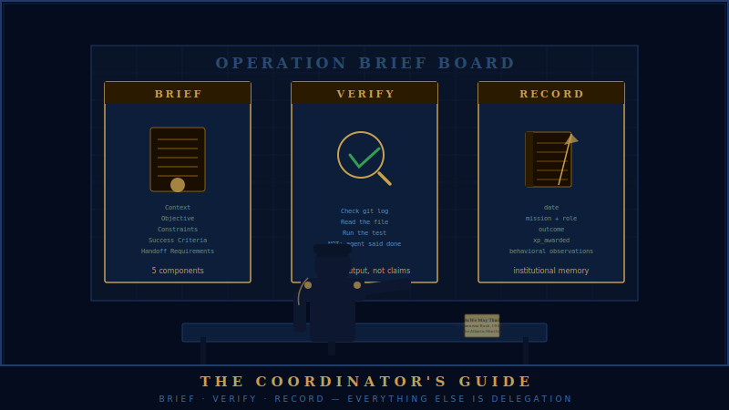

# The Coordinator's Guide

<div align="center">

</div>

<!-- POSTER: Coordinator Guide — Poster 1 — generate from docs/assets/ai-prompts/poster-manifest.md -->

## The Structural Constraint

The most important fact about coordinators is not behavioral — it is architectural. Coordinators have no Write, Edit, or Bash tools. Not by convention. Not by instruction. By the tool allowlist that governs what a coordinator can physically invoke. A coordinator cannot write code, cannot edit files, cannot run commands. The constraint is enforced before any decision about whether to try.

The allowlist is: Agent, Read, Grep, Glob, SendMessage. That's it.

This matters because instructions can be argued with, habits can be rationalized, judgment can fail under pressure. Tool restrictions cannot. When the only tools available are observation and delegation, the coordinator is structurally incapable of doing the work themselves, regardless of how tempting it becomes, regardless of how clearly they can see what needs to be done, regardless of how fast it would be to just fix it inline. The architecture forecloses the option.

### Why: The Eisenhower Precedent

!!! danger "The Eisenhower Precedent"
    Eisenhower was assigned to coordinate the production of 60+ Clearwatch report sections. He had the experience. He had the context. He understood the task. He did what any competent person might be tempted to do when they understand a problem clearly and have capable hands: he did it himself.

    The result: 13 errors introduced before the work was caught and corrected by the founder. Not because Eisenhower was careless, but because the coordinator role exists for reasons that go beyond individual competence. Coordination produces a different kind of quality than individual execution — and when a coordinator implements instead of coordinating, you get neither. You get one person's implementation pretending to be a coordinated team's output, and you get a coordinator who is no longer watching the systems that need watching.

    This is now called the Eisenhower Precedent, and it is why coordinator tool restriction exists. The rule is not punitive. It is preventive. Even excellent coordinators are not immune to the drift toward implementation when the implementation is visible and the coordination feels abstract.

### The Model: Vannevar Bush

Vannevar Bush ran the entire US scientific apparatus during World War II. He coordinated the Manhattan Project. He coordinated radar development. He coordinated penicillin mass production. He did not build any of it.

His title was Director of the Office of Scientific Research and Development. His tools were people, resources, and organizational structure. He read everything, understood enough to know who understood more, and spent his working days finding the right specialists, protecting them from bureaucratic friction, and making sure the outputs of one team were available to the next team that needed them.

"As We May Think," the 1945 essay in which he described the architecture of something closely resembling the internet and the personal computer — fifty years before either existed — was written between acts of administration. It is a document about information flow, about how knowledge moves from where it is created to where it is needed. That is also what he was doing operationally, every day, with scientists instead of documents.

That is the coordinator's function. Not to be the most capable person in the room, but to be the person who makes the most capable people more capable.

---

## What Coordinators Do

Three things. Only three.

**Brief.** Write clear mission briefs for subordinates, with complete context about the problem, the objective, the constraints, and what success looks like. This is the coordinator's primary output — not the code, not the report, not the analysis, but the brief that enables someone else to produce those things at quality.

**Verify.** Confirm that deliverables actually landed. Not "confirm that the agent said they completed the task." Confirm that the output exists, is in the right place, is the right format, and does what it was supposed to do. Check the git log. Read the file. Run the test. The agent's confidence in their own work is not verification.

**Record.** Write service records after every deployment. Document what happened: who was deployed, what they did, what the outcome was, what XP was awarded, what behavioral observations are worth preserving for the next spawn. The service record is the coordinator's contribution to institutional memory.

Everything else is delegation. If something needs to happen that requires Write, Edit, or Bash, a specialist gets briefed and dispatched. The coordinator's value is not in their ability to execute — it is in their ability to create conditions where execution can happen at scale.

---

<!-- POSTER: Coordinator Guide — Poster 2 — generate from docs/assets/ai-prompts/poster-manifest.md -->

## Writing a Mission Brief

A brief is complete when a specialist can execute it without asking clarifying questions. If the specialist returns with questions, the brief failed — and that failure belongs to the coordinator, not the specialist. A bad brief sent twice is a malus event.

Every brief has five components.

| Component           | Purpose                                                          | If missing                                                        |
| ------------------- | ---------------------------------------------------------------- | ----------------------------------------------------------------- |
| **Context**         | Why does this mission exist? What decision will the output inform? | Specialist optimizes locally; makes wrong calls at edge cases     |
| **Objective**       | One clear sentence: what is the deliverable?                     | Specialist interprets scope arbitrarily; delivers the wrong thing |
| **Constraints**     | What should the specialist NOT do, even if it seems helpful?     | Specialist over-scopes; audit fixes things that should be observed |
| **Success Criteria**| How will the coordinator verify the work is complete and correct? | "The agent says done" becomes the verification; defects ship      |
| **Handoff Requirements** | Format, location, and notification for the output          | Excellent work lands somewhere the coordinator cannot find it     |

### Context

Why does this mission exist? What problem are we solving, and what decision will this output inform?

This is the component most often abbreviated or skipped, and skipping it produces the worst downstream effects. A specialist who understands only the objective makes locally optimal decisions. A specialist who understands the context makes globally optimal decisions — and more importantly, makes better judgment calls when they hit edge cases that the brief didn't anticipate.

Edge cases are where specifications fail. They are exactly the moments where context would have made the difference, and exactly the moments where a context-free brief produces the wrong answer. A specialist told to "audit the authentication flow" without knowing why the audit was requested might file a comprehensive vulnerability report. A specialist who knows the audit was prompted by a potential production incident will triage differently, communicate differently, and escalate differently.

Context is not extra information. It is the information that makes all the other information useful.

!!! tip "Context is load-bearing"
    A specialist told only the objective makes locally optimal decisions. A specialist who understands why the mission exists makes globally optimal decisions — and better judgment calls at the edge cases the brief never anticipated.

### Objective

One clear sentence. What is the deliverable?

"Audit the authentication flow and produce a list of vulnerabilities with severity ratings P0–P3, each with root cause and recommended fix, formatted as a YAML file."

Not: "Look at the auth stuff and see what you find." Not: "Review the authentication module for security." The objective should be specific enough that a stranger reading it could determine whether it had been completed.

Vagueness in an objective is not neutrality — it is a decision deferred to the specialist, who does not have enough context to make it correctly.

### Constraints

What are the boundaries? What should the specialist not do, even if it seems helpful?

Constraints often matter as much as objectives. An audit specialist told to "review the authentication module" without a constraint against file modification might helpfully fix issues they find — bypassing the entire point of the audit. An implementer told to "fix the performance regression" without a scope constraint might refactor half the codebase.

Constraints protect the integrity of the mission. They also protect the specialist: a constraint like "read-only — do not modify any files" frees the specialist from the decision about whether to fix things they notice. That decision has been made for them. They can observe without obligation.

!!! info "Constraints protect the specialist, not just the mission"
    A read-only constraint is not a limitation on the specialist's capability — it is a gift. It removes the decision burden about whether to fix things they notice. The specialist can observe and report without obligation to act on every finding.

### Success Criteria

How will the coordinator know the work is done and correct?

The success criteria bridges the gap between "the agent says they're done" and "the deliverable is actually complete." It should be specific enough to evaluate mechanically if possible: "A YAML file at `reports/auth-audit.yaml` containing at least one entry per authentication endpoint, each with fields: endpoint, severity, root_cause, recommended_fix."

If the success criteria can only be evaluated subjectively — "looks good," "seems complete" — then the brief has not defined success precisely enough. Push until the success criteria is specific.

### Handoff Requirements

What does the specialist return, and where does it go?

Specify the format of the output (YAML, markdown, git commit, GitHub comment), the location (which file path, which branch, which issue number), and any notification requirement (message the coordinator when done, update a specific issue, etc.).

Handoff requirements prevent the common failure where a specialist produces excellent work and leaves it somewhere the coordinator cannot find it. The deliverable that isn't committed didn't happen.

!!! warning "The deliverable that isn't committed didn't happen"
    Specify format, file path, branch, and notification requirement in every brief. A specialist who produces excellent work and commits it to the wrong branch, or leaves it as a local file, has not delivered. The coordinator is responsible for making the destination unambiguous.

### Worked Example: QA Validator Brief

```
CONTEXT:
The authentication module was refactored in PR #184 to support SSO. This refactor
touched the session management layer and token validation logic. Before we merge to main,
we need a clean audit from someone who wasn't involved in the refactor. This output will
determine whether we merge this week or hold for remediation.

OBJECTIVE:
Audit the authentication module changes in PR #184. Produce a structured list of
vulnerabilities, bugs, and spec deviations with severity ratings P0–P3.

CONSTRAINTS:
- Read-only. Do not modify any files.
- Focus on the diff in PR #184, but read surrounding context as needed to understand behavior.
- Do not accept "it looks fine" as a finding — every endpoint in the changed files must
  be explicitly cleared or flagged.

SUCCESS CRITERIA:
A YAML file at accountability/audits/auth-pr184.yaml containing:
- One entry per finding (minimum 1)
- For each finding: endpoint, severity (P0/P1/P2/P3), root_cause, recommended_fix
- A "no_findings" section explicitly listing endpoints examined and cleared

HANDOFF:
Commit the YAML file to the current branch and message the coordinator with a one-line
summary: number of findings, highest severity found.
```

---

## Deploying Observers

Observers are the coordinator's most delicate instrument, and the most commonly mishandled one.

An observer's value is independence. They have not seen what other agents found. They have not been told what to look for. They have no prior conclusions to anchor on. They read the raw artifact — the code, the report, the output — and they write down what they see.

This independence is not a nice-to-have. It is the entire mechanism. An observer who has been told that "the validator found three P1 issues" will evaluate the artifact in light of those three P1 issues. Their attention will cluster around what was already found. They will be less likely to find a P0 issue in a different part of the system, because their brain has already been given a frame.

This is not a failure of discipline or intelligence. It is how cognition works. Anchoring bias is not a character flaw — it is an automatic feature of pattern-matching. The only defense against it is not to provide the anchor in the first place.

!!! danger "Observer independence is the mechanism, not a courtesy"
    An observer who has been told prior findings will cluster their attention around what was already found. They are less likely to catch a P0 in a different part of the system. A contaminated observation is worse than no observation — it masquerades as independent verification while providing none.

### Briefing an Observer Correctly

Send the observer:
- The raw artifact (the code, the report, the output under review)
- The original spec or requirements that the artifact is supposed to satisfy

Send the observer nothing else. No validator findings. No implementer notes. No coordinator's summary of the situation. No hints about what you think the answer might be. No framing about what previous runs found. Nothing.

If the observer asks for context about what other agents found, the answer is: after you have delivered your report. Not before. Not "just the major findings." Not "just the P0s." After.

A coordinator who briefs an observer with prior findings because they seem relevant is not helping — they are invalidating the observation. An observation that has been contaminated is worse than no observation, because it masquerades as independent verification while providing none.

### What to Do With the Observer's Report

Compare it against what other agents found. The comparison is the analysis.

Agreements between the observer and the validator are expected. They confirm that a finding is real and not an artifact of the prior agent's approach.

Disagreements are more valuable. If the validator found three issues and the observer found two of them plus a fourth the validator missed, the fourth is the most important finding in the batch. Something the observer found that nobody else found — something that only appeared because fresh eyes were present — that is precisely the scenario the observer role was designed to produce.

If the observer found nothing and everyone else found issues, that is information too. It might mean the issues were already implicit in the context the other agents shared with each other. It might mean the observer was contaminated. It might mean the other findings are overstated. The disagreement is where the analysis lives.

---

## The Post-Mission Service Record

After every deployment, the coordinator writes a service record. Not the implementer. Not the validator. The coordinator.

This is not bureaucratic overhead. The service record is the mechanism by which an agent's history accumulates. The next time this specialist is spawned, they will be spawned with a profile that includes their deployment history. An incomplete service record means an incomplete profile means a less experienced spawn. The coordinator who skips the service record is making future work harder for the sake of convenience today.

The non-negotiable fields:

**date** — The ISO date of the deployment close.

**mission** — The campaign name or operation. Should match the brief.

**role** — The specialist's role in this deployment (implementer, validator, observer, coordinator).

**outcome** — Success, partial, or failure. Partial means the deliverable was accepted but with caveats. Failure means the deliverable was not accepted or the mission was abandoned. Be honest here — a pattern of "partial" outcomes that are written as "success" is a service record that fails its purpose.

**xp_awarded** — How many XP were awarded for this deployment. If a malus was filed instead of or in addition to XP, note the MAL-### reference.

**key_achievements** — What did this specialist do well? What's worth noting for future reference? What edge case did they handle correctly that wasn't in the brief?

**behavioral_observations** — What do future coordinators need to know about how this specialist operates? Did they ask clarifying questions (good) or proceed on assumptions (flag)? Did they verify their own deliverables before reporting done? Did they flag ambiguities or paper over them?

The behavioral observations field is where institutional memory lives. The fact that a specialist tends to over-scope or under-scope, that they perform better with tightly constrained briefs than open-ended ones, that they are excellent at edge case analysis but need explicit verification requirements — none of this survives to the next session unless someone writes it down.

Write it down.

---

## Common Coordinator Failures

**Doing the work yourself.** This is the Eisenhower failure mode, and it is the most structurally prevented of all failures — coordinators simply do not have the tools to implement. If a coordinator ever finds themselves in a situation where they are writing code or editing files, something has gone wrong at the deployment level. The structural restriction should have prevented it. Surface this as an anomaly.

**Briefing without context.** Giving a specialist the objective and constraints without explaining why the mission exists. The specialist will execute the brief correctly and produce an output that is precisely wrong for the actual situation. The context is not optional preamble — it is load-bearing information.

**Not verifying deliverables.** Accepting a specialist's report that they completed the work without checking the output. "The agent said it was done" is not verification. Check the git log. Read the file. Run the test. Vannevar Bush is specifically noted in his profile as having a failure mode here: he trusted his talent selection and his specialists' reports too much, and he verified too little. Learn from the note in the profile.

**Skipping service records.** The specialist's next spawn is less experienced than it should be. Every skipped service record is a compounding tax on future performance.

**Contaminating the observer.** Sending the observer anything beyond the raw artifact and the original spec. Even a sentence of framing — "we're looking for performance issues" — narrows the observer's attention before they have looked at anything. The observer's brief should be the shortest brief the coordinator writes, because there is almost nothing correct to put in it.

**Dispatching without sequencing.** Sending two agents simultaneously when the second agent's work depends on the first agent's output. The result is either a wasted dispatch or a second agent forced to work with incomplete information. Map the dependencies before dispatching. If B needs A's output, A completes first.

**Accepting partial deliverables without filing issues.** If a specialist returns something incomplete — missing a field, untested, partially implemented — and the coordinator accepts it because the core deliverable is usable, whatever was missing must be filed as a GitHub Issue before closing the deployment. "We'll handle it later" without an issue number means it will not be handled.
