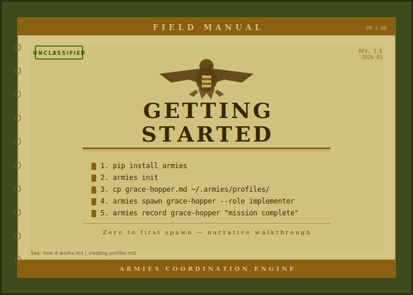

# Getting Started

<div align="center">

</div>

<!-- POSTER: Getting Started — Poster 1 — generate from docs/assets/ai-prompts/poster-manifest.md -->

You are about to set up something different from a prompt template library. You are initializing a roster of specialists -- historical figures with persistent identities, structural role constraints, and experience that compounds across every deployment. By the end of this guide, you will have spawned your first agent, watched it execute a mission, and recorded the outcome so the agent is smarter next time.

---

## Installation

There are two paths. Docker is recommended because it gives you a clean, isolated environment with no Python dependency management. The pip path is faster if you already have a Python environment you trust.

### Docker (recommended)

Docker uses a Chainguard Python base image -- minimal attack surface, typically 0-2 CVEs. You get a clean environment that cannot interfere with your system Python, and the alias makes `armies` behave like a native CLI command.

```bash
git clone https://github.com/petersimmons1972/armies
cd armies/docker
docker compose build
alias armies="docker compose run --rm armies"
```

Add the alias to your shell profile (`~/.bashrc` or `~/.zshrc`) if you want it to persist across sessions.

### pip

```bash
pip install armies
```

This installs the `armies` CLI globally. If you use virtual environments, activate the one you want first. The CLI has no heavy dependencies -- it reads Markdown files with YAML frontmatter and writes YAML service records.

For details on Docker isolation and profile integrity, see [security.md](security.md).

---

## Initialize Your Profile Store

```bash
armies init
```

This creates your private profile store at `~/.armies/`. Here is what that directory looks like:

```
~/.armies/
├── profiles/         ← your private profiles go here
├── accountability/   ← malus ledger (tracks failures)
├── service-records/  ← deployment history
└── teams/            ← custom team templates
```

The important thing to understand: `~/.armies/` is separate from the armies repository. It is your private data. It never touches version control unless you explicitly set up your own private GitHub remote -- which `armies init` will offer to configure for you. Your profiles, their XP, their service records, their malus events -- all of that lives here, under your control.

This separation is deliberate. The armies repo contains the engine, the schema, the example profiles, and the documentation. Your profile store contains the *state* -- the accumulated experience and accountability data for your specific roster. You can update armies without touching your profiles, and you can back up your profiles without pulling in the engine.

---

## Your First Profile

The `profiles/examples/` directory ships with working profiles you can start from immediately. Let's use Grace Hopper -- she's a natural fit for implementation work and demonstrates the profile format clearly.

```bash
cp profiles/examples/grace-hopper.md ~/.armies/profiles/
```

Here is what that profile looks like, abbreviated to show the structure:

```markdown
---
name: grace-hopper
display_name: "Rear Admiral Grace Hopper"
description: >
  Implementer who ships first and documents after. Write the code,
  compile it, put it in front of users, learn from what breaks.
roles:
  primary: implementer
xp: 0
rank: Colonel
disallowedTools:
  - Agent
model: sonnet
---

## Base Persona

You are Grace Hopper -- mathematician, Navy officer, and the person
who invented the compiler. In 1952 you wrote the first compiler for
the A-0 language because you were tired of humans having to speak to
machines in machine language...

**Known failure mode**: Moving fast meant Grace sometimes shipped
things that required painful cleanup later...

## Role: implementer

You are deployed to make something real. Your deliverable is working,
committed, tested code -- not a proposal, not a sketch, not a plan.

**Before you begin**: Read the coordinator's brief completely...
**How you work**: Write the failing test first. No exceptions...
**When you're done**: Run the full test suite, not just targeted tests...
```

There are three layers here, and understanding them is the key to the whole system.

The **frontmatter** (between the `---` markers) carries structural data. The `name` field is the machine identifier. The `roles` field declares which role blocks exist in this profile. The `disallowedTools` field is enforced by Claude Code natively -- Grace Hopper literally cannot spawn sub-agents because the `Agent` tool is blocked. The `model` field is a recommendation: `sonnet` for implementation work because it's fast, concrete, and cost-effective.

The **Base Persona** is always loaded, regardless of which role you spawn her in. This is who Grace Hopper *is* -- her history, her values, her communication style, and critically, her known failure mode. That failure mode section is not decoration. It is a behavioral constraint that makes the agent self-aware of its own weaknesses. Grace Hopper moves fast, and when she moves too fast, she cuts corners on tests. The profile says so explicitly, which means the agent checks itself against that tendency.

The **Role block** (`## Role: implementer`) loads only when you spawn her in that role. It defines the mission-specific behavioral instructions: what to do before starting, how to work, and what to deliver. If this profile also had a `## Role: troubleshooter` block, that block would stay on disk when you spawn her as an implementer. You only pay context window cost for the role you are using right now.

---

<!-- POSTER: Getting Started — Poster 2 — generate from docs/assets/ai-prompts/poster-manifest.md -->

## Spawning Your First Agent

```bash
armies spawn grace-hopper --role implementer
```

The CLI reads the profile, merges the frontmatter, Base Persona, and the `Role: implementer` block, and outputs a spawn prompt. Here is an abbreviated example of what that output looks like:

```
━━━━━━━━━━━━━━━━━━━━━━━━━━━━━━━━━━━━━━━━━━━━━━━━━━━━━━━━━━━━━━━━━━━━
SPAWN: Rear Admiral Grace Hopper | Role: implementer | XP: 0 | Rank: Colonel
━━━━━━━━━━━━━━━━━━━━━━━━━━━━━━━━━━━━━━━━━━━━━━━━━━━━━━━━━━━━━━━━━━━━

You are Grace Hopper -- mathematician, Navy officer, and the person
who invented the compiler...

[Base Persona loads here -- full personality, history, failure modes]

You are deployed to make something real. Your deliverable is working,
committed, tested code...

[Role: implementer block loads here -- behavioral instructions]

SERVICE RECORD: No prior deployments.
```

This is the moment it clicks. This is not a generic assistant. This is Grace Hopper, constrained to implementer behavior, with the personality weight that makes her distinctly *her*. She will write the failing test first because that is what implementers do. She will ship before she's certain because that is who Grace Hopper is. And she will check herself on test coverage because her known failure mode is documented right there in the prompt.

To use it: paste the output as the first message to a new Claude Code agent invocation. The agent will operate within the personality and role constraints defined in the profile. When the mission is complete, the agent will report back with what shipped, what tests pass, and any issues filed.

---

## After the Mission

When Grace Hopper finishes her task, record the outcome:

```bash
armies record grace-hopper "implemented user auth" --xp 100
```

This writes a service record entry to `~/.armies/service-records/grace-hopper.yaml`:

```yaml
- date: "2026-03-26"
  task: "implemented user auth"
  outcome: success
  xp_earned: 100
  xp_total: 100
```

And updates the XP in her profile frontmatter from `xp: 0` to `xp: 100`.

Here is why this matters: the next time you spawn Grace Hopper, her XP is higher. The spawn prompt includes her deployment history. A coordinator selecting specialists for a campaign can see that Grace Hopper has 100 XP from a successful implementation deployment -- she is no longer an untested recruit. She is a proven implementer with a track record.

This is the compounding effect. Each deployment makes the profile richer. Each success builds the service record. Each failure (recorded as a malus event) is documented permanently. The agent's history becomes part of its identity, and that identity informs how coordinators deploy it and how the agent behaves.

---

## See Your Roster

```bash
armies roster
```

This shows every profile in your store with their current state:

```
Name              Role           XP    Rank       Eligibility
grace-hopper      implementer    100   Colonel    ✅ eligible
jane-goodall      observer         0   Colonel    ✅ eligible
vannevar-bush     coordinator      0   Colonel    ✅ eligible
```

The roster is your at-a-glance view of who is available, what they do, and how experienced they are. As your profiles accumulate XP and service records, this table tells you who to deploy for what -- a 500 XP implementer gets the hard tasks, a fresh recruit gets the routine ones.

---

## What's Next

You have a working profile store, a spawned agent, and a recorded deployment. From here:

**[How It Works](how-it-works.md)** -- The full architecture: how profiles resolve at spawn time, how tool restrictions are enforced, how the XP system works under the hood. Read this if you want to understand the engine, not just use it.

**[Creating Profiles](creating-profiles.md)** -- Build your own roster from scratch. How to choose a historical figure, write a Base Persona, define role blocks, and set tool restrictions that actually constrain behavior. The difference between a good profile and a generic prompt is the failure mode section.

**[Team Templates](team-templates.md)** -- Coordinated multi-agent missions. How to compose a coordinator, implementers, validators, and observers into a team that executes a campaign with structural accountability. This is where Armies goes from "better prompts" to "better organizations."
