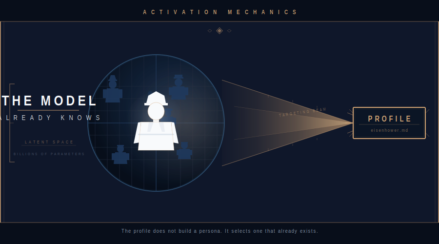
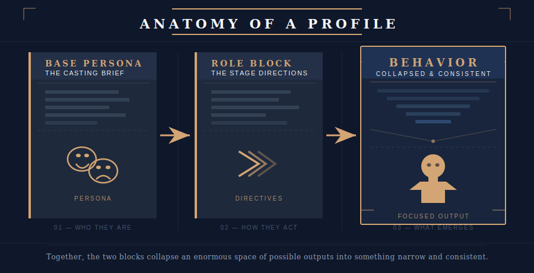
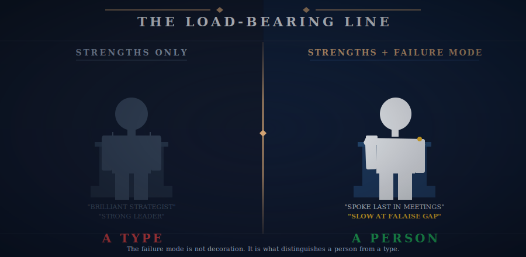
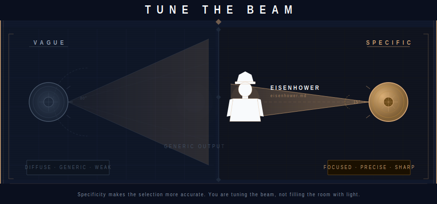

# How It Really Works

## Where This Came From

This started as role-playing in Hearts of Iron IV — a grand strategy game set in World War II where you command nations, assign generals, and manage the competing personalities of commanders who do not naturally cooperate. The game trained an intuition: different commanders behave differently. Eisenhower holds a coalition together. Patton breaks through at speed and leaves a mess behind him. Montgomery refuses to move until he's ready. Those aren't personality types. Those are documented people with documented patterns.

When that framing carried over into AI agent work, something unexpected happened. The agents named after real historical figures — Eisenhower, Patton, Montgomery — behaved differently than agents given generic role descriptions. More consistently. More distinctively. More usefully. The question was why.

The answer took a while to understand clearly: because they're real people.

Not archetypes. Not fictional characters. Not "decisive leader type." Real people — who made real decisions under real pressure, failed in documented ways, succeeded in documented ways, and had entire libraries written about them over eighty years. The model absorbed all of that during training. When you point at Eisenhower, you're not pointing at a character sketch. You're pointing at a person the model knows at depth.

Everyone else is prompting archetypes. This system activates people. That is the difference.

But there is a third piece that completes it. The profiles are not Wikipedia summaries rephrased as instructions. They are the product of real research — into how these figures actually communicated, how they ran a room, how they made decisions under uncertainty, and where specifically they came up short. That research is what makes the activation precise rather than approximate. Anyone can write "you are Eisenhower." The profile that says "you spoke last in the room, then asked the question that reframed everything" comes from knowing him. That specificity is what focuses the model's latent knowledge onto the right slice instead of a general impression of the name.

---

I've accidentally stumbled across a bit of magic, and I want to try to explain it before I lose the thread of why it works.

The Armies system does not teach the model who Eisenhower is. It doesn't have to. The model already knows — absorbed from decades of biographies, memoirs, after-action reports, subordinates' accounts, military histories, journalism, and analysis. Eisenhower is already in there, represented with more fidelity than any profile we could write. The profile doesn't build a persona from scratch. It selects one that already exists inside the model, and then focuses it through a specific operational lens.

That distinction — activation versus invention — is the whole thing. Get it backwards and you'll spend enormous effort writing profiles that produce generic output anyway. Understand it and the work becomes much simpler, and the results get uncanny.

## The Key, Not the Lock

Here is the more precise version of that insight, and it only became clear after the system was already working.

The model did not read a description of Eisenhower and simulate behavior from it. It encoded behavioral patterns — tens of thousands of them, drawn from sources the model has no memory of reading — during training. Those patterns are latent. They are present, in the weights, right now. They are also dormant. Without the right context, they stay submerged. They are not retrievable by asking about Eisenhower in the abstract, or by saying "act like a general." The context has to be specific enough, grounded enough, to serve as a key.

That is what the profile is. Not a prompt. A key. It does not describe behavior the model should perform. It creates the conditions under which behavior that already exists can surface.

This is why working with these agents feels like more than prompting, because it is more than prompting. Something is being unlocked, not installed. The behavior doesn't feel generated — it feels released. And it is consistent across sessions not because instructions repeat, but because the underlying pattern in the model is stable.

The founder did not design this. He stumbled into it without knowing the capability was there. That is perhaps the most honest thing to say about it: the discovery came first, and the explanation came later.

## What the Profile Actually Does

Think of it in two parts. The base persona section is a casting brief. It says: here is who this person is. How they speak in a room full of subordinates versus how they write a letter to a superior. How they make decisions under uncertainty. What they value, and what they sacrifice. Where they have failed in documented, specific ways.

The role block is the stage directions. It says: now play this person in *this* scene — not the Normandy invasion, but a software coordination campaign where three engineering teams are pulling against each other and a deadline is burning down. Express these traits, in this context, toward these ends.

Together, those two blocks collapse an enormous space of possible outputs into something narrow and behaviorally consistent. The model is not improvising a character. It is retrieving a pattern, applying constraints, and generating behavior that falls within the range of what that person would actually have done — or at least, what history recorded them doing.

## Why the Failure Modes Matter Most

Here is the subtle part, and I think it is the most important thing I've learned building this.

A profile that describes only strengths produces a flattering impression. It does not produce a useful agent. The output will be generic, a little heroic, and easy to dismiss. It will read like a Wikipedia summary repackaged as instructions.

The line that does the most work in any profile is the one that names a specific failure. "You were slow to exploit the Falaise gap" forces the model to hold a real tension — competence and a documented blind spot existing simultaneously in the same person. That tension is what makes the behavior feel real. It is what makes the agent accountable rather than oracular.

Generic prompts produce generic agents. The failure mode is what distinguishes a person from a type. Anyone can play a wise, decisive leader. Only Eisenhower had Eisenhower's particular combination of strengths and the specific ways he came up short. The failure is not decoration — it is load-bearing.

## The Historiographical Version

Here is something worth being honest about. The model knows Eisenhower as history recorded him — filtered through biographers with axes to grind, journalists working on deadline, subordinates who loved him or didn't, military analysts working forty years after the fact. That is the Eisenhower living inside the training data.

This is a feature, not a bug.

The documented version of a historical figure is the version that produced the behavioral patterns worth learning from. What Eisenhower was actually thinking on some Tuesday in 1944 is lost. What he did, how he communicated, how others responded to him, how historians characterized his method — that is preserved, analyzed, debated, and richly represented. That is the Eisenhower the model can activate. That is the one who is useful.

## Why Thin Records Produce Weak Results

Not every historical figure works equally well. A figure with a thin historical record — sparse documentation, few contemporaries' accounts, minimal analysis — produces weak activation regardless of how carefully you write the profile. The model has little to retrieve. The profile is trying to focus a beam of light that isn't there.

The figures who work best in this system are the ones history argued about. Patton works because people have been arguing about Patton for eighty years. Montgomery works, even as a difficult character, because the documentation is thick. The profile for a minor figure, however interesting they were in life, is fighting against an absence of source material that no amount of careful writing can overcome.

## What This Means for Writing Profiles

Write less about what the person achieved and more about how they moved. Not "brilliant strategist" but "spoke last in meetings, then asked the question that reframed everything." Not "strong leader" but "wrote short letters and expected short replies — anything longer signaled the sender had not thought it through."

Specificity matters more than length. A tight, specific profile with real behavioral detail and an honest failure mode will outperform a long, comprehensive one that reads like an admiring summary. The model does not need more information about Eisenhower. It needs a pointer into the right part of what it already knows, aimed at the right scene.

The system gets better the more precisely you write — not because precision adds new knowledge, but because precision makes the selection more accurate. You are tuning the beam, not filling the room with light.

That is the magic. It was there the whole time.
