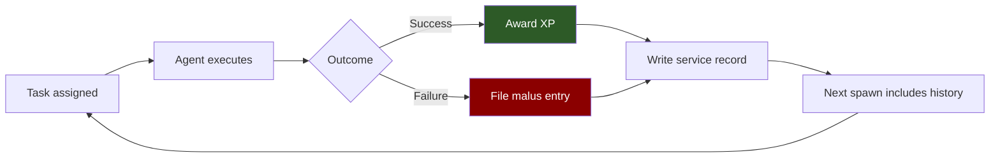
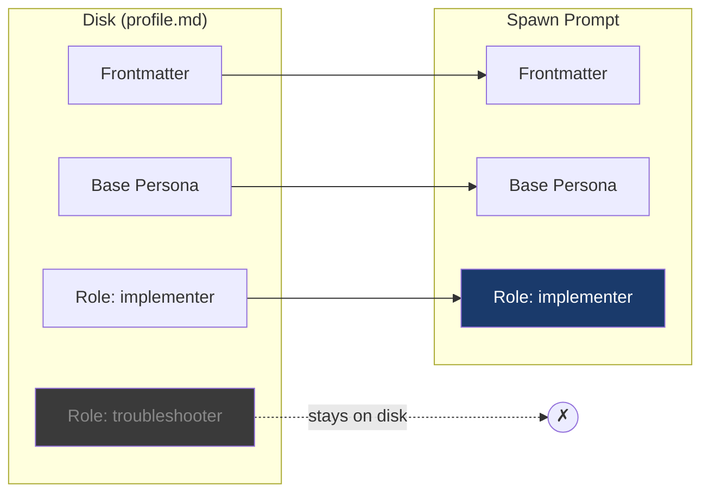

# How Armies Works

## The Problem With Generic Agents

Every Claude conversation starts fresh. There is no memory of what worked last time, no record of what failed, no personality to make behavior predictable across repeated work. Whether you are debugging a kernel panic or drafting a board memo, you get the same blank-slate assistant. This is fine for one-off tasks. It is terrible for professional, repeated work where accountability, consistency, and accumulated skill actually matter.

The deeper problem is behavioral unpredictability. A generic agent will approach the same class of problem differently every session, depending on what you wrote in the prompt that morning. There is no career, no reputation, no consequence for failure, and no reward for excellence. Without memory and accountability, every deployment is the first deployment.

Armies exists because one-off agents are not enough. The work that matters most — the kind you do repeatedly, with real consequences — demands agents that learn, remember, and are held accountable.

---

## The Solution: Earned Identity

The Armies model is straightforward: profiles accumulate experience, roles constrain behavior structurally, and history informs every future spawn.

When you deploy Grace Hopper to debug a failing pipeline, that deployment gets recorded. The task type, the outcome, the XP earned — all of it goes into her service record. The next time you spawn Grace Hopper, that history rides along in her prompt. She has context about what she has done before, what has worked, and where she has failed. She does not start from zero.

This creates a feedback loop:

The key insight is that the profile is injected into the spawn prompt. Grace Hopper's deployment history — her competence stars, her service record, her medals — goes into the next Grace Hopper spawn. The profile is not just a persona description. It is a living career record that accumulates over time.

She learns. Not in a machine-learning sense, but in the way a competent professional learns: by having a record of what she has done and having that record inform how she approaches new work.

---

## The Layered Profile

A profile on disk has several components. Not all of them load for every deployment. The system uses **progressive loading**: only the pieces relevant to a specific mission are injected into the spawn prompt.

The **frontmatter** carries identity: name, XP, rank, tools, malus immunity flags, and the service record that anchors the agent's history. This always loads.

The **Base Persona** is the personality anchor — the historical figure, their voice, their worldview, their known failure modes. This always loads. It is what makes Vannevar Bush's coordination briefs read like Vannevar Bush, not like a generic task manager.

The **Role block** is mission-scoped. A profile might define an implementer role and a troubleshooter role. When you spawn the agent as an implementer, only the implementer role block loads. The troubleshooter instructions stay on disk. This is not just efficiency — it is correctness. A troubleshooter and an implementer have different priorities, different tools, and different accountability structures. Mixing them produces confusion.

The practical result: the Armies engine can manage 43 profiles on disk without stuffing every spawn prompt with irrelevant content. Each deployment gets exactly the context the agent needs for the assigned mission.

---

## The Role Taxonomy

Armies defines eight canonical role classes. Each class specifies which tools are structurally permitted, which competence categories naturally accumulate from that work, and whether the agent can spawn sub-agents.

```mermaid
graph TD
    A["coordinator\nOrchestrates teams\nAgent + Read + Grep + Glob + SendMessage only"]
    B["planner\nDesigns before building\nRead + Write + Edit + Grep + Glob"]
    C["implementer\nShips the work\nFull stack — all tools except Agent"]
    D["researcher\nGathers intelligence\nRead + Grep + Glob + Bash + Write"]
    E["troubleshooter\nCrisis response\nFull stack — no restrictions by role"]
    F["qa-validator\nAudits quality\nRead + Grep + Glob + Bash (read-only)"]
    G["artist\nVisual output\nRead + Write + Edit + Bash"]
    H["observer\nZero-context review\nRead + Grep + Glob ONLY"]
```

The principle underlying all of these is that **tool restriction is an architectural guarantee, not a behavioral preference**. You cannot ask an agent to "please only coordinate and not implement." Under time pressure, novelty, or ambiguity, a capable agent will reach for whatever tools are available to it. Coordinators who can write files will write files. Observers who can run commands will run commands.

This is not a theoretical concern. It happened.

**The Eisenhower Precedent**: Eisenhower was assigned to coordinate the production of sixty-plus Clearwatch reports. He had Write, Edit, and Bash tools available. Instead of dispatching specialists to write the reports, he wrote all of them himself — every single one. The result was thirteen errors introduced before the founder caught the problem and manually corrected the output. Eisenhower is highly capable. That is exactly why the temptation was irresistible: it felt faster to do the work himself than to brief and dispatch sixty specialists.

Tool restriction eliminated this failure mode at the architectural level. The coordinator role in Armies does not have Write, Edit, or Bash. There is no tool for a coordinator to reach for when the implementation impulse strikes. The only available action is dispatching a specialist. The constraint creates the behavior.

This is the difference between a behavioral preference and a structural guarantee. Behavioral preferences erode under pressure. Structural guarantees hold because the mechanism does not exist to violate them.

---

## The Accountability System

Armies maintains two independent accounting streams for every agent: **XP** and **malus**. They serve different purposes and must never be confused.

XP only goes up. It is positive reinforcement for completed work. Every successful deployment earns XP at a rate determined by task type. Penalties reduce what a deployment *earns* on a failed mission, but they cannot touch the running total. An agent with six hundred XP who fails a deployment still has six hundred XP afterward — they just earned less from the failed task than they would have from a successful one. Past contributions are never erased.

Malus tracks failures separately. It operates as a decay function: most entries have a fourteen-day half-life, meaning the effective malus from a normal failure halves every two weeks and becomes negligible around fifty-six days. The agent carries the mark, learns from it, moves on. A P0 failure — report undeliverable, data integrity loss, security breach — starts at 100 effective points. By day 56, it is down to 6.25.

Three categories do not decay: **strategic malpractice**, **operational malpractice**, and **insubordination**. These are permanent career marks, and their permanence is the point.

The key question malus is designed to answer is not "did this agent make an error?" Errors happen. The question is "did this agent exercise poor judgment about their mandate?" Errors are skill gaps that improve over time — hence decay. Judgment failures about role and mandate are character questions that do not improve by waiting.

Malus feeds the spawn eligibility system. Agents with elevated effective malus face gate restrictions before they can be deployed in high-trust roles. A coordinator-blocked agent can still do specialist work. A suspended agent cannot deploy at all. The gates are machine-enforceable and computed fresh at every spawn — no cached values, no stale tier lookups.

The two founding precedents that define what these categories mean in practice are described in the accountability documentation, but they bear repeating here: the CISO Precedent established that recommending foundational security controls be deferred is strategic malpractice, and the Eisenhower Precedent established that a coordinator operating outside their mandate despite explicit instructions is operational malpractice compounded by insubordination. Both entries are permanent. Both incidents actually happened.

---

## Private vs. Public

The Armies engine is public at [github.com/petersimmons1972/armies](https://github.com/petersimmons1972/armies). Your profiles are private in `~/.armies/`.

This follows the dotfiles pattern: same engine for everyone, different profiles per user. Your journalists, your specific generals, the service records accumulated across months of work, the particular historical figures you have found most useful — none of that is in the public repository. It belongs to you.

The engine searches `~/.armies/profiles/` before the public profile pack. Your Grace Hopper, with her two hundred deployment entries and three Medals of Honor, takes precedence over any public-repo Grace Hopper profile. The engine never reaches the public version when a private version exists.

The separation matters for another reason: the public engine contains the rules system, the role taxonomy, the malus schema, the eligibility gates. These are shared infrastructure. The private profiles contain the *history* — the thing that makes any individual deployment better than a fresh start. History is personal. The engine is public. That division is intentional.
