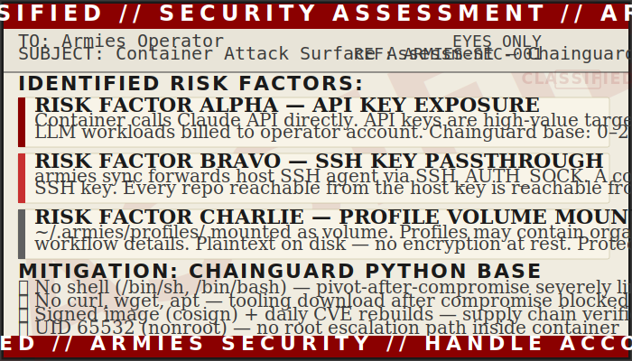

# Security

<div align="center">

</div>

<!-- POSTER: Security — Poster 1 — generate from docs/assets/ai-prompts/poster-manifest.md -->
<!-- POSTER: Security — Poster 2 — generate from docs/assets/ai-prompts/poster-manifest.md -->

---

## Docker Base Image: Chainguard Python

The Armies Docker image uses `cgr.dev/chainguard/python:3.11` as its base instead of
the standard `python:3.11-slim`. This is a deliberate security choice, not a
convenience preference.

### What Chainguard images are

Chainguard images are minimal, distroless-style container images built and maintained
by Chainguard Inc. They share design philosophy with Google's distroless images but
are rebuilt daily with the latest upstream patches. Every release is signed with
[cosign](https://github.com/sigstore/cosign) and ships with a software bill of materials
(SBOM), giving you a complete inventory of every package in the image. The Python
variant includes only what Python actually needs to run — no apt, no bash, no curl,
no package manager of any kind.

### Why it matters for Armies

Armies sits at an unusual intersection of risks:

**API key exposure.** The container is the process that calls the Claude API (or coordinates
with it). Claude API keys are high-value targets — they can be used to run arbitrary LLM
workloads billed to your account.

**SSH key passthrough.** `armies sync` forwards your host SSH agent into the container via
`SSH_AUTH_SOCK`. A compromised container is, functionally, a compromised SSH key. Any
repo your key can reach is reachable from inside the container.

**Profile access.** Your `~/.armies/profiles/` directory is mounted as a volume. Profiles
may contain organizational context, team structures, and workflow details you would not want
exposed.

These three factors together mean the container's attack surface matters more than it would
for a typical utility tool.

### The CVE difference

Standard `python:3.11-slim` images typically carry 40–50+ known CVEs at any point in time,
most of them in packages that Python itself does not need (Debian base utilities, unused
libraries). Chainguard Python typically carries 0–2 CVEs on average, because the image
contains almost nothing beyond the Python runtime and its direct dependencies.

Daily rebuilds mean that when a new CVE is published and patched upstream, the Chainguard
image picks up the fix within hours. The standard Python image depends on the Debian release
cycle, which can mean weeks or months before a patched image is available.

### No shell in production

Chainguard distroless images do not include `/bin/sh`, `/bin/bash`, or any shell. This is
intentional. An attacker who compromises the Python process (for example, via a dependency
chain vulnerability) has no shell to pivot from. There is no curl, no wget, no package
manager to pull additional tools. The blast radius of a compromised container is dramatically
smaller.

One practical consequence: you cannot run `docker exec -it <container> bash` against the
production image. If you need to inspect a running container, use a debug sidecar:
```bash
kubectl debug -it <pod> --image=alpine -- sh
# or for local Docker:
docker run --rm -it --volumes-from <container_id> alpine sh
```

### The UID 65532 note

Chainguard images run as non-root user UID 65532 (`nonroot`) by default. This affects
volume mounts: the `~/.armies/` directory on your host must be readable and writable by
UID 65532 as seen by the container's Linux namespace.

The `docker-compose.yaml` handles the mapping. If you see permission errors on `~/.armies/`,
see [troubleshooting: permission denied](troubleshooting.md#docker-compose-run-volume-mount-permission-denied).

If you build a custom image extending the Chainguard base, be explicit about UID in any
`COPY --chown` or `RUN chown` instructions.

### Supply chain verification

Chainguard images are signed. For production deployments, verify the signature before
running:

```bash
# Install cosign if not present
brew install cosign   # macOS
# or: go install github.com/sigstore/cosign/v2/cmd/cosign@latest

# Verify a Chainguard Python image
cosign verify cgr.dev/chainguard/python:3.11 \
  --certificate-identity-regexp 'https://github.com/chainguard-images' \
  --certificate-oidc-issuer https://token.actions.githubusercontent.com
```

A verified signature means the image you pulled is byte-for-byte what Chainguard built and
published. An unverifiable image means something in the supply chain has changed.

For routine local use, verification is optional. For any deployment where the container
processes credentials (Claude API keys, SSH keys, GitHub tokens), it is worth doing.

---

## What Armies Does NOT Do

Be clear about the limits of the security model.

**Armies does not encrypt `~/.armies/` at rest.** Your profiles, malus ledger, service
records, and config are plaintext YAML and Markdown on your local filesystem. Anyone with
read access to your home directory can read them. If your laptop is stolen or your home
directory is accessible to other users, those files are accessible.

**Armies does not authenticate `armies sync` beyond git credentials.** The sync mechanism
is a wrapper around `git pull` and `git push`. Your GitHub access is protected by your SSH
key (or personal access token). Armies adds no additional authentication layer on top of
that. Protect your GitHub token and SSH key as you normally would.

**Armies does not sandbox the spawned Claude agents.** When you paste a spawn prompt into
a Claude Code Agent tool call, that agent runs with whatever tools its profile declares
(or that Claude Code defaults to). Armies controls which _instructions_ the agent receives,
not which _capabilities_ it has at the platform level. An implementer profile that declares
`disallowedTools: [Agent]` will have the Agent tool blocked — but only because Claude Code
enforces that, not because Armies enforces it.

**The malus system tracks accountability, not security controls.** Malus is an
organizational accountability mechanism. It can block a general from being spawned in
certain roles based on past performance. It is not a security gate — it does not prevent
a human from copy-pasting a blocked agent's prompt directly.

---

## Your Private Profiles

The Armies engine is public. Your profiles are private. This separation is maintained by
`~/.armies/` living entirely outside the public repo.

Your profiles never exist in the `~/projects/armies/` directory — they live in `~/.armies/`
on your host machine. The Docker image contains only the engine (source code and
dependencies). Your profile data comes in only through the volume mount at runtime.

This separation works as long as you do not accidentally commit `~/.armies/` content to
your armies fork. The `.gitignore` in the repo excludes common paths. But if you have
added `~/.armies/` to your repo manually (for example, while experimenting with a
different layout), check before pushing:

```bash
# Check what is staged
git -C ~/projects/armies status

# Check what is tracked
git -C ~/projects/armies ls-files | grep '.armies'

# If anything from ~/.armies/ appears, remove it from tracking
git -C ~/projects/armies rm --cached path/to/file
echo 'path/to/file' >> ~/projects/armies/.gitignore
git -C ~/projects/armies commit -m "chore: exclude accidentally tracked profile file"
```

If you maintain a private fork of the armies repo that includes your profiles, that is a
valid approach — but be intentional about it. Keep the repo private, protect the branch,
and treat any accidental public push as a credential rotation event.
