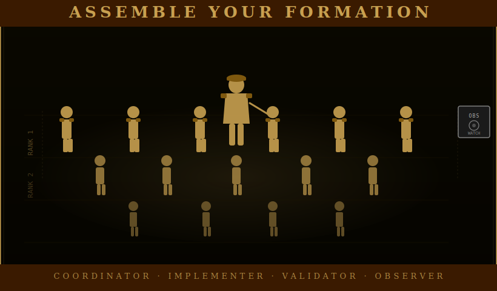

# Team Templates

<div align="center">

</div>

<!-- POSTER: Team Templates — Poster 1 — generate from docs/assets/ai-prompts/poster-manifest.md -->

Running a multi-agent mission without a template is like assigning a project without
deciding who owns what. The people are available, the work needs doing, and somehow
nothing ships because no one agreed on the roles. Templates solve that problem before
it starts.

A team template is a pre-solved composition for a common mission type. It specifies
which roles to deploy, how many of each, what model to run them on, and any special
briefing notes for individual slots. When you pick the right template and fill the
slots with the right profiles, the team structure is already working for you before
the first agent receives a brief.

The five built-in templates cover the most common mission shapes. You can extend or
replace them with your own.

---

## Built-In Templates

### Standard Development Team

**File:** `teams/standard.yaml`

The default. This is the right composition for feature work, refactoring,
implementation sprints — anything where you know what you are building and you need
to build it correctly.

The team is: one coordinator (opus), two implementers (sonnet, running in parallel
on independent tasks), one qa-validator (sonnet, reviews output and can run tests),
and one observer (sonnet, zero-context fresh-eyes review at the end).

The two implementers are the center of gravity. They run in parallel on independent
work streams, which means the coordinator's most important job is ensuring the
briefs are genuinely independent — tasks that share a file, a function, or a
dependency cannot be safely parallelized. When they are truly independent, you get
twice the throughput at the cost of the coordinator's sequencing discipline.

The qa-validator is downstream of the implementers. Their job is to verify that
what shipped matches what was specified, that the tests pass, and that no
regressions appeared. They can write new tests; they do not modify implementation.

The observer is last in the sequence and receives nothing from the other agents.
They see only the raw output — the code, the changed files, the diff — and report
what they actually find rather than confirming what the validators already said.

**Use this template when:** you are doing normal development work.

**Do not use this template when:** you are in a crisis (use Emergency Firefighting),
or when nothing is specified yet and you are still figuring out what to build (use
Planning Session).

---

### Quality Sprint

**File:** `teams/quality-sprint.yaml`

Zero-defect audit mode. Security reviews, pre-release checks, production readiness
gates — any situation where the cost of a missed defect is high enough that you
want multiple independent reviewers rather than one fast pass.

The team is: one coordinator (opus), two qa-validators (sonnet, auditing in parallel),
one troubleshooter (sonnet, emergency reserve), and one observer (sonnet, pure
fresh eyes).

The two qa-validators are the operational core here. They audit in parallel —
which means they should receive different scopes, or the same scope with
instructions to work independently and not compare notes until the coordinator
collects both reports. Two validators who read each other's findings before
completing their own are one validator with an extra step.

The troubleshooter is not expected to act. Their presence is insurance. If both
qa-validators hit a blocker they cannot resolve — a dependency issue, a system
access problem, a root cause that requires active debugging rather than passive
review — the troubleshooter deploys. In a mission where nothing goes wrong, the
troubleshooter sits idle. That is fine. That is what insurance is.

The observer in this template is more constrained than in the standard template:
they receive no prior validator findings at all. Not a summary, not a note about
focus areas — nothing. They see only the source material. When the coordinator
collects all reports, the observer's findings serve as a check on anchoring bias:
did the validators find the real issues, or did they find the issues they expected
to find?

**Use this template when:** you need a thorough pass before something goes out to
users, before a security-sensitive deployment, or any time the cost of a missed
bug significantly exceeds the cost of the extra review.

---

### Research Spike

**File:** `teams/research-spike.yaml`

Deep-dive intelligence before you build anything. The research spike answers the
question: do we know enough to write a specification?

The team is: one planner (opus), two researchers (sonnet, investigating different
aspects in parallel), and one observer (sonnet, sanity-check on the findings before
the planner synthesizes).

The planner is unusual here because they work both at the beginning and the end of
the mission. They open by writing the research brief — what questions need answering,
what the synthesis structure should look like, what the threshold is for knowing
enough to proceed. Then they step back while the researchers work. When the
researchers return with findings, the planner synthesizes them into a usable output.

The two researchers divide the problem space. The brief should give each researcher
a distinct angle: one investigates prior art and existing implementations, the other
investigates failure modes and known limitations, for example. Researchers who
receive identical scopes will produce overlapping findings that are harder to
synthesize than complementary ones.

The observer in the research spike has a specific job: they read the raw researcher
output and report what they notice before the planner synthesizes. Their purpose
is to catch findings that the planner's synthesis frame might smooth over — the
detail that doesn't fit the emerging narrative but might be the most important
thing in the dataset.

**Use this template when:** you don't know enough yet to write a feature spec. The
research spike is the step before the planning session — it answers whether you
can plan, and if so, what the plan needs to account for.

---

### Emergency Firefighting

**File:** `teams/firefighting.yaml`

Something is on fire in production. This template is built for speed and parallel
diagnosis.

The team is: two troubleshooters (opus, running in parallel on root cause), one
implementer (sonnet, on standby), and one observer (sonnet, documenting the incident).

The two troubleshooters are the departure from normal team design. In every other
template, parallel agents work on independent tasks. Here, they work on the same
problem — deliberately. Two troubleshooters investigating the same incident
independently will converge on the root cause faster than one troubleshooter working
sequentially, because they will try different hypotheses in parallel and one of them
will be right sooner. When both converge on the same root cause independently, you
have high confidence before you patch anything.

The implementer does not investigate. They sit on standby. The moment the
troubleshooters confirm root cause, the implementer deploys with a precisely scoped
brief: here is what broke, here is why, here is the minimal fix. Speed on the patch
depends on having a clear root cause — which is why the troubleshooters establish
that before the implementer moves.

The observer's job in this template is documentation only, not code review. They
maintain the incident timeline: what failed, when, what was tried, what was found,
what was patched, and when normal operations resumed. This is incident record
keeping, not independent review. The output is the post-mortem foundation, not a
parallel audit.

Note that the troubleshooters in the firefighting template run on opus rather than
sonnet. Root cause analysis under pressure with incomplete information is a high-
judgment task. The cost is justified.

**Use this template when:** something is actively broken in production and the root
cause is not yet known.

---

### Planning Session

**File:** `teams/planning-session.yaml`

Architecture before implementation. This template produces a specification that is
ready for a development team to execute — not a concept, not a direction, but a
design with enough detail to write briefs from.

The team is: two planners (opus), one coordinator (opus), and one researcher (sonnet).

The two planners are the most important structural choice in this template. A single
planner produces a plan they are committed to. Two planners produce competing plans
they are willing to argue against. The coordinator receives two proposals that have
been independently developed and selects — or synthesizes — the better one. The
output is more robust than anything one planner would produce working alone, because
each planner's design is stress-tested by the existence of the other.

Brief the two planners with the same problem statement but give them genuine creative
latitude. The value is in the divergence. If you constrain both planners toward the
same approach, you pay for two planners and get one plan.

The researcher's role is support. They surface prior art, existing implementations,
known failure patterns, and technical constraints before the planners begin designing.
They are informing the design space, not participating in the design. The researcher
delivers their findings to the coordinator, who incorporates them into both planning
briefs.

**Use this template when:** you are about to build something non-trivial and do not
yet have a specification. The planning session is upstream of implementation — it
produces the artifact that the Standard Development Team works from.

---

<!-- POSTER: Team Templates — Poster 2 — generate from docs/assets/ai-prompts/poster-manifest.md -->

## The Observer Is Not Optional

Every built-in template includes an observer. This is not an oversight or a
budgetary oversight that got left in — it is deliberate, and it reflects a specific
lesson about how multi-agent review actually works.

The problem with review panels is anchoring. When one agent produces a finding and
shares it with the next agent before that agent has done their own work, the second
agent's findings are influenced by the first. They may confirm findings they would
not have reached independently. They may miss findings that don't fit the frame the
first agent established. The more agents in the chain, the more severe the anchoring
becomes — by the fifth reviewer, everyone has converged on the first reviewer's
initial hypothesis.

The observer breaks that chain. Because the observer receives no prior findings —
no summary, no scanner output, no notes from other agents — they see only the raw
work. They report what they actually find. When the coordinator collects all reports,
the observer's output can be compared against the validators': do they agree? Where
they diverge, something interesting is happening.

Jane Goodall named her chimpanzee subjects when the scientific establishment said
this was methodologically unsound, that it would compromise objectivity. She said
it would improve her observations. She was right — naming them made her pay closer
attention, not less. The lesson is not about naming. It is about observation
protocol design: she thought carefully about how to structure her observation
practice so that it produced useful data, and she was willing to depart from
convention when convention was producing worse science.

Observer deployment works the same way. The convention is to brief reviewers with
context so they know what to look for. But a reviewer who knows what to look for
finds what they were told to find. The observer who is given nothing finds what is
actually there.

---

## Customizing Templates

Built-in templates live in `teams/`. Custom templates go in `~/.armies/teams/`.
The format is the same:

```yaml
# ~/.armies/teams/my-custom-team.yaml
name: My Custom Team
description: What this team is for and when to use it
composition:
  - role: coordinator
    count: 1
    model: opus
  - role: implementer
    count: 2
    model: sonnet
  - role: observer
    count: 1
    model: sonnet
    notes: Any special briefing notes for this slot
```

The `notes` field is human-readable advisory text for whoever is running the team.
It does not get injected into agent prompts — it is guidance for the coordinator
composing the mission. Use it to document special briefing requirements, scope
constraints, or pairing instructions that are specific to this team's purpose.

Model selection follows the same logic as profile design: `opus` for judgment-heavy
roles (coordinator, planner, complex audit work), `sonnet` for execution roles
(implementer, researcher, artist, observer, troubleshooter in most cases). The
firefighting template is an exception — troubleshooters run on opus when the problem
is novel and the stakes are high.

---

## The Walt/Roy Example

The affinity field on Walt Disney's profile (pointing to `roy-disney`) is advisory
— the engine does not enforce it. But it becomes most useful when you are composing
a custom template for a mission that needs both a creative and an operational anchor.

Here is what a template that makes explicit use of the pairing looks like:

```yaml
# ~/.armies/teams/creative-production.yaml
name: Creative Production
description: >
  Visual design and art direction with financial and operational discipline.
  Use when a campaign requires both generative creative work and someone to
  hold the scope boundaries while the creative work happens.
composition:
  - role: coordinator
    count: 1
    model: opus
    notes: >
      Consider Roy Disney for this slot — Walt's affinity field points here.
      Roy works best when he knows Walt is the artist he is coordinating for.
  - role: artist
    count: 1
    model: sonnet
    notes: >
      Consider Walt Disney for this slot. Brief him clearly on scope — he will
      expand it in pursuit of quality. Roy needs to know where the scope went.
  - role: planner
    count: 1
    model: opus
    notes: >
      Theodor Geisel for constraint-first design work. Give him the constraints
      before asking for the plan — that is how he works best.
  - role: observer
    count: 1
    model: sonnet
```

The `notes` fields in this template document the intent without enforcing it.
You still select the actual profiles when you run the team — the template is not
an automatic pairing mechanism. But the documentation inside the template means
that anyone running it understands why the slots exist and which profiles they were
designed around.

This is the right way to encode institutional knowledge in a template: not as
enforcement, but as intent that a future coordinator can read and understand.

---

## Choosing the Right Template

The most common mistake is using the Standard Development Team for everything.
It works for a lot of missions, but it is not optimized for missions that require
heavy auditing, deep research before design, crisis response, or architectural
decision-making. Picking the wrong template is not a disaster — it just means the
team is configured for a different kind of work than you are actually doing.

A simple heuristic:

- **You know what to build and you need to build it correctly** → Standard Development Team
- **You need to audit something thoroughly before it ships** → Quality Sprint
- **You don't know what to build yet** → Research Spike, then Planning Session
- **Something is broken right now** → Emergency Firefighting
- **You know the problem but not the design** → Planning Session, then Standard

The templates are not exhaustive. They are starting points. Build custom templates
for the patterns that show up repeatedly in your own work, and put them in
`~/.armies/teams/` where they will be there the next time you need them.
