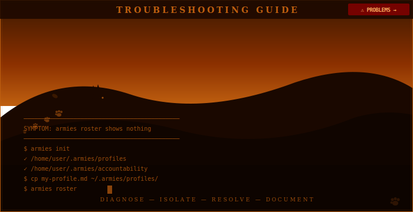

# Troubleshooting

<div align="center">

</div>

<!-- POSTER: Troubleshooting — Poster 1 — generate from docs/assets/ai-prompts/poster-manifest.md -->

Common problems, their causes, and how to fix them. Problems are organized by category.

---

## Setup Problems

### "armies command not found"

**Symptom:** Running `armies` in the terminal returns `command not found` or `armies: No such file or directory`.

**Cause:** The `armies` binary is not in your `PATH`. This typically happens when you have used `go install` but `$GOPATH/bin` is not in your `PATH`, or when you have downloaded the binary but have not moved it to a directory in your `PATH`.

**Fix:**

If you installed via `go install`:
```bash
# Find where Go puts installed binaries
go env GOPATH
# Output: /home/user/go  (or similar)

# The binary is at $GOPATH/bin/armies
# Add $GOPATH/bin to your PATH in ~/.bashrc or ~/.zshrc:
export PATH="$HOME/go/bin:$PATH"

# Reload your shell config
source ~/.bashrc   # or source ~/.zshrc

# Verify
armies --help
```

If you downloaded a pre-built binary:
```bash
# Move the binary to a directory already in your PATH
chmod +x armies
sudo mv armies /usr/local/bin/armies

# Or move it to a personal bin directory
mkdir -p ~/bin
mv armies ~/bin/armies
export PATH="$HOME/bin:$PATH"   # add to ~/.bashrc or ~/.zshrc

# Verify
armies --help
```

---

### "permission denied" when running the binary

**Symptom:** Running `./armies` or `armies` returns:
```
-bash: /usr/local/bin/armies: Permission denied
```

**Cause:** The downloaded binary does not have the executable bit set. Pre-built binaries are distributed as plain files. They need `chmod +x` before they can be run.

**Fix:**
```bash
chmod +x armies
# Then move to PATH as above, or run directly:
./armies --help
```

---

### Architecture mismatch

**Symptom:** Running `armies` returns:
```
cannot execute binary file: Exec format error
```
or on macOS:
```
bad CPU type in executable
```

**Cause:** You downloaded the binary for the wrong architecture. The release page publishes separate binaries for `linux-amd64`, `linux-arm64`, `darwin-amd64`, and `darwin-arm64`. Running an amd64 binary on an arm64 machine (or vice versa) produces this error.

**Diagnosis:**
```bash
# Check your machine's architecture
uname -m
# x86_64   → you need the amd64 binary
# aarch64  → you need the arm64 binary
# arm64    → you need the arm64 binary (macOS Apple Silicon)

# Check what you downloaded
file armies
# armies: ELF 64-bit LSB executable, ARM aarch64, ...
# (or x86-64 — should match uname -m output)
```

**Fix:** Download the binary that matches your architecture from the releases page, or build from source for your exact platform:

```bash
git clone https://github.com/petersimmons1972/armies
cd armies
go build -o armies .
```

Building from source always produces a binary for the machine you are building on. There is no cross-compilation required for personal use.

---

### "armies roster shows nothing"

**Symptom:** Running `armies roster` prints:
```
No profiles found in /home/user/.armies/profiles
Run armies init to create the directory structure.
```

**Cause:** `~/.armies/profiles/` is empty or does not exist yet.

**Fix:**
```bash
# Create the directory structure
armies init

# Install the bundled example profiles (Grace Hopper, Jane Goodall, and others)
armies seed

# Or copy a specific profile manually
cp examples/generals/grace-hopper.md ~/.armies/profiles/

# Verify
armies roster
```

`armies seed` is the fastest way to get started. It unpacks all the bundled example profiles from the binary into `~/.armies/profiles/` in one step.

---

### "armies init: directory already exists" (or similar)

**Symptom:** Running `armies init` on an existing installation shows `config.yaml already exists — skipping prompt`.

**Cause:** `~/.armies/` was already initialized in a previous session.

**Fix:** This is not an error. `armies init` is idempotent — it creates missing directories and skips creation for anything that already exists. If you want to change your remote URL, edit `~/.armies/config.yaml` directly:

```bash
# Edit config manually
nano ~/.armies/config.yaml

# Config fields:
# remote_url: git@github.com:you/armies-profiles.git
# default_model: sonnet
# profiles_dir: /home/user/.armies/profiles
```

---

### "armies sync: no remote_url configured"

**Symptom:** `armies sync` prints:
```
Error: remote_url not configured
```

**Cause:** `~/.armies/config.yaml` has `remote_url: ""` or the key is missing.

**Fix:**
```bash
# Edit config.yaml and set your GitHub repo URL
nano ~/.armies/config.yaml

# Set:
# remote_url: git@github.com:yourname/your-private-profiles.git

# Then make sure git is initialized and the remote is set
git -C ~/.armies remote add origin git@github.com:yourname/your-private-profiles.git
# or if origin already exists:
git -C ~/.armies remote set-url origin git@github.com:yourname/your-private-profiles.git
```

---

## Profile Problems

### "Role block 'X' not found in profile Y. Available roles: ..."

**Symptom:** `armies spawn grace-hopper --role researcher` prints:
```
Role block '## Role: researcher' not found in grace-hopper.md
Available role blocks:
  Role: implementer
```

**Cause:** The profile's Markdown body does not contain a `## Role: researcher` section. The frontmatter may declare `roles.primary: implementer` only, with no secondary role.

**Fix:** Either use a role that the profile declares, or edit the profile to add the role block. Each role listed in frontmatter must have a corresponding body section:

```markdown
---
roles:
  primary: implementer
  secondary: researcher   # ← declare the secondary role here
---

## Role: implementer
...

## Role: researcher       # ← and add the matching body section
...
```

Run `armies roster` to see which profiles exist, then `armies spawn <agent> --role <role>` with a role that matches the profile.

---

### "Profile not appearing in roster"

**Symptom:** A `.md` file is in `~/.armies/profiles/` but `armies roster` does not list it (or the roster shows fewer agents than expected).

**Cause:** The most common cause is a YAML parse error in the profile's frontmatter. YAML is whitespace-sensitive and silently fails on certain formatting errors.

**Fix:** Run `armies test <agent-name>` to validate the profile:

```bash
armies test grace-hopper
# Output: PASS — all required sections present
# or:     FAIL — missing section: ## Base Persona
```

`armies test` checks for all required sections and reports structural errors without spawning the agent. It is the fastest way to diagnose a profile that is not appearing in the roster.

If you want to inspect the frontmatter directly:

```bash
head -30 ~/.armies/profiles/my-profile.md
```

Common frontmatter errors:
- **Tabs instead of spaces** — YAML requires spaces for indentation, not tabs
- **Unquoted special characters** — colons, brackets, or `#` in values need quoting:
  ```yaml
  # Wrong:
  description: Planner: strategic thinking
  # Right:
  description: "Planner: strategic thinking"
  ```
- **Inconsistent indentation** — all fields at the same level must use the same indentation depth
- **Missing closing `---`** — frontmatter must be delimited by `---` on both sides

---

### "armies spawn produces empty output"

**Symptom:** `armies spawn` exits without printing anything, or prints only the frontmatter with no body sections.

**Cause:** The profile file exists but is empty, or the body contains no `## Base Persona` or matching `## Role:` sections.

**Fix:** Open the profile and verify it has:

```markdown
---
name: my-agent
...
---

## Base Persona

[Content here — required]

## Role: implementer

[Content here — required if implementer is declared in roles]
```

If the file is truly empty, the profile was likely created as a placeholder. Either populate it or remove it from the profiles directory.

---

### "XP field rejected" or XP not updating

**Symptom:** XP does not change, or you see an error when trying to set XP manually.

**Cause:** XP is a read-only field managed by the service record system. It is never set directly in the profile frontmatter. Starting XP for a new profile is always `0`.

**Fix:** Do not set XP manually. The correct workflow is:
1. Complete a deployment
2. Append a service record entry to the agent's service record YAML (in `~/.armies/service-records/<name>.yaml` or inline in the profile)
3. The service record entry specifies `xp_earned`, which is then summed to compute total XP
4. Commit the service record update

If you believe XP is wrong, file a GitHub Issue documenting the discrepancy. Do not edit the XP field directly.

---

## Eligibility Problems

### "BLOCKED: effective malus too high"

**Symptom:** `armies eligible <agent>` shows `BLOCKED` for all roles, or `armies roster` shows an agent as `BLOCKED`.

**Cause:** The agent's computed effective malus is 400 or higher, placing them in the Suspension tier. This means their ledger entries — weighted by share and decay — sum to at least 400 points.

**Fix:**
```bash
# See the full breakdown
armies eligible <agent>
# Shows: effective malus, tier, and per-role gate status

# Inspect the actual ledger entries
cat ~/.armies/accountability/malus-ledger.yaml
```

Non-decaying entries (operational malpractice, insubordination) do not reduce over time. Decaying entries halve every 14 days. The effective malus will naturally decrease as decaying entries age. For non-decaying entries, resolution requires explicit founder action — mark the entry as resolved in the ledger.

---

### "armies eligible: malus-ledger.yaml not found"

**Symptom:** `armies eligible <agent>` prints:
```
Note: Ledger not found at /home/user/.armies/accountability/malus-ledger.yaml.
Showing gates for zero malus.
```

**Cause:** No malus has been recorded yet — the ledger file does not exist.

**Fix:** This is normal for new installs. The note is informational, not an error. Effective malus is 0 and all roles show CLEAR.

If you expected the file to exist:
```bash
# Verify the accountability directory was created
ls ~/.armies/accountability/

# Run armies init if the directory is missing
armies init
```

The ledger file is created automatically when a malus entry is first written. Its schema is:
```yaml
- id: MAL-001
  date: 2026-03-01
  raw_malus: 100
  decays: false
  allocation:
    - agent: eisenhower
      share: 100
  type: operational_malpractice
  description: "Brief description of the incident"
```

---

## Git Sync Problems

### "git push rejected: remote has changes"

**Symptom:** `armies sync` shows:
```
! [rejected] main -> main (non-fast-forward)
```

**Cause:** The remote repository has commits that your local `~/.armies/` does not have. This happens when profiles are updated on another machine or directly on GitHub.

**Fix:**
```bash
cd ~/.armies
git pull --rebase
# Resolve any conflicts if present
# Then push manually or re-run armies sync
git push
# or:
armies sync
```

---

### "git remote not set"

**Symptom:** `armies sync` returns:
```
Error: remote_url not configured
```
or git operations fail with `fatal: 'origin' does not appear to be a git repository`.

**Cause:** `armies init` was not completed with a remote URL, or was run without one.

**Fix:**
```bash
# Initialize git in ~/.armies/ if not already done
git -C ~/.armies init

# Add the remote
git -C ~/.armies remote add origin git@github.com:yourname/armies-profiles.git

# Also update config.yaml so armies sync knows the URL
nano ~/.armies/config.yaml
# Set: remote_url: git@github.com:yourname/armies-profiles.git
```

---

### "SSH key not forwarded" / "git@github.com: Permission denied (publickey)"

**Symptom:** `armies sync` fails with a permission denied error from GitHub, even though your SSH key works in other contexts.

**Cause:** Your SSH key is not loaded into the SSH agent, or the agent is not running.

**Diagnosis:**
```bash
# Check whether SSH agent is running
echo $SSH_AUTH_SOCK
# Should print a path like: /run/user/1000/keyring/ssh
# If it's empty, the agent is not running

# Check which keys are loaded
ssh-add -l
```

**Fix:**

On **macOS**:
```bash
# Load key into the macOS keychain-backed agent
ssh-add --apple-use-keychain ~/.ssh/id_ed25519
```

On **Linux**:
```bash
# Start the agent if not running
eval $(ssh-agent -s)

# Add your key
ssh-add ~/.ssh/id_ed25519

# Confirm SSH_AUTH_SOCK is now set
echo $SSH_AUTH_SOCK
```

Once the host agent has your key loaded, retry:
```bash
armies sync
```
